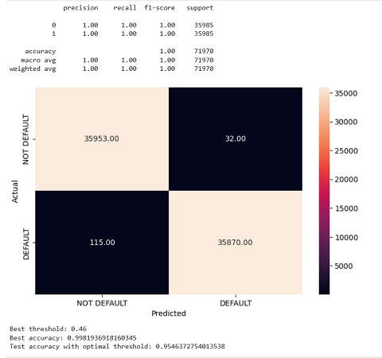
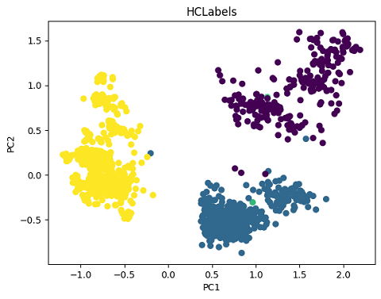

# Portfolio

---

## Data Science

### [Classification: loan default prediction](/Loan_Default_Prediction)

### [Presentation](pdf/Loan_Default_Prediction.pdf)

##### Download:

##### <a href="/Loan_Default_Prediction.ipynb" download>Loan_Default_Prediction.ipynb</a>

##### <a href="pdf/Loan_Default_Prediction.pdf" download>Presentation Loan_Default_Prediction.pdf</a>

---

### [Classification: Travel Experience Satisfaction](/Shinkansen_Travel_Experience_Satisfaction_Analysis)

##### Download:

##### <a href="/Shinkansen_Travel_Experience_Satisfaction_Analysis.ipynb" download>Shinkansen_Travel_Experience_Satisfaction_Analysis.ipynb</a>
---
### [Segmentation: Marketing compaing](pdf/Marketing_Campaign_Analysis)
 

##### Download:

##### <a href="/Marketing_Campaign_Analysis.ipynb" download>Marketing_Campaign_Analysis.ipynb</a>
---
---

## Power BI

### [Een woning kiezen in Nederland](pdf/Levensstandaard_per_regio_NL.pdf)

##### Download:

##### https://drive.google.com/uc?export=download&id=1zBi8Nlpn-380CowMTQdm6PAngpQutAjc

