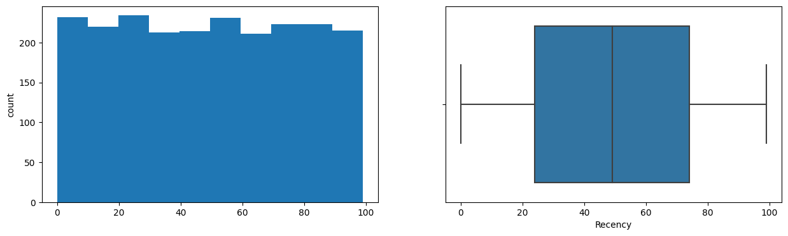
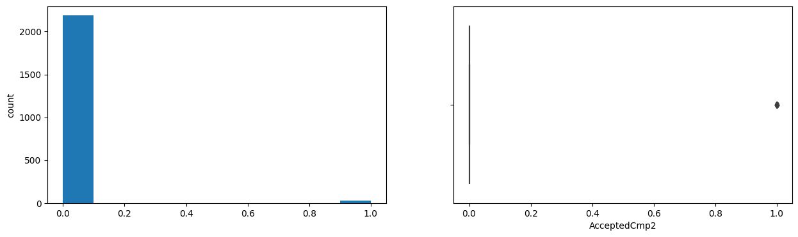
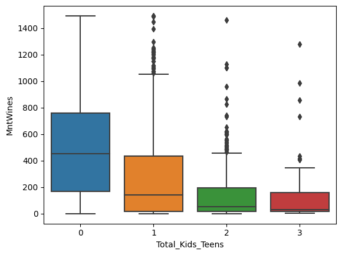
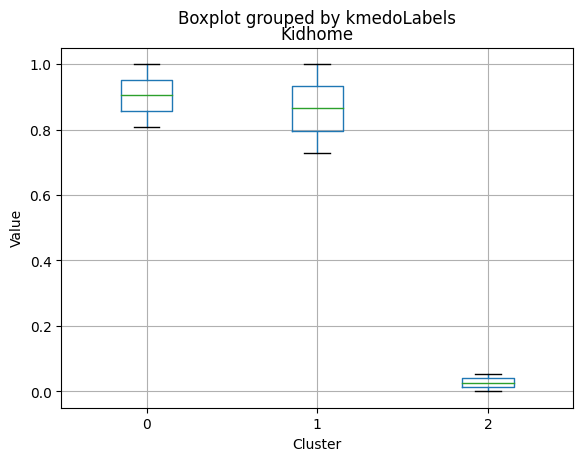
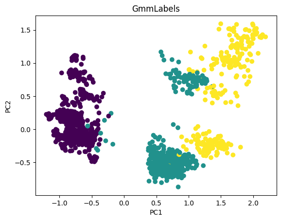
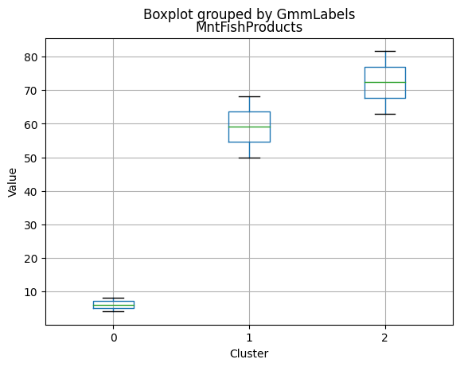
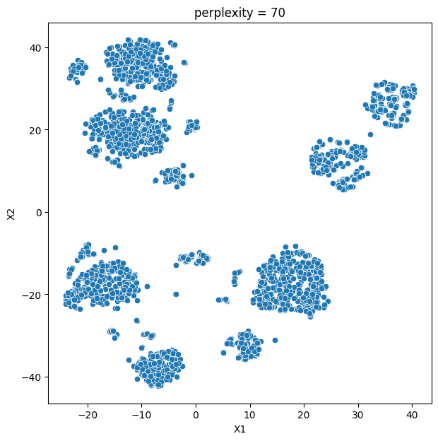
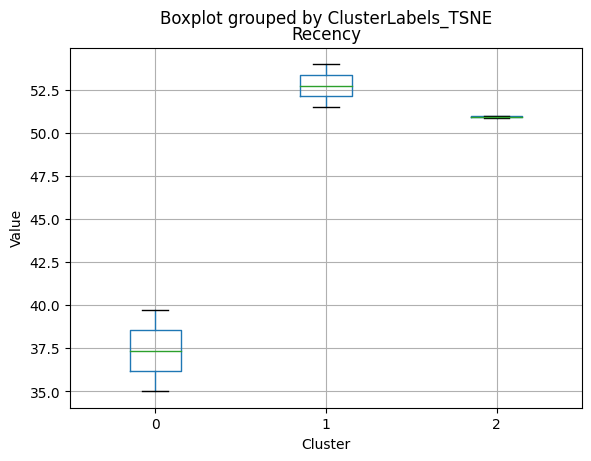
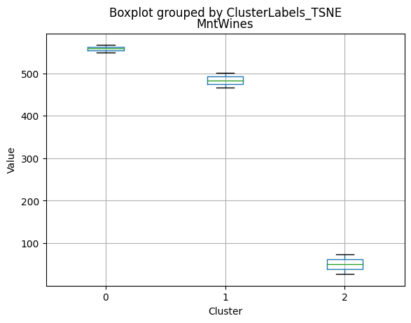
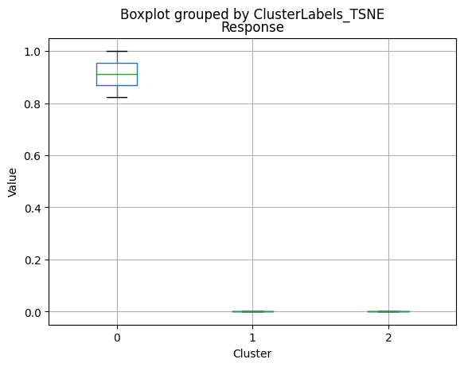

# **Marketing Campaign Analysis**

## **Problem Definition**

### **The Context:**

 - Why is this problem important to solve?
-  **The problem of customer segmentation is important to solve for marketers as it can lead to a significant growth in revenue by enabling personalized communication and offerings to individual customers.**

### **The objective:**

 - What is the intended goal?
- **The intended goal is to analyze customer engagement metrics and marketing activities data to create the best possible customer segments that optimize ROI.**

### **The key questions:**

- What are the key questions that need to be answered?
1. **What are the customer profiles and how can they be defined?**
2. **What metrics to use for customer segmentation?**
3. **How to determine the optimal number of segments?**

### **The problem formulation**:

- What is it that we are trying to solve using data science?
- **Using data science techniques, the objective is to segment customers based on their profiles and enable personalized communication and offerings to individual customers.**


Return on Investment (ROI) is a critical metric for evaluating the effectiveness of marketing campaigns and other business initiatives. By segmenting customers based on their engagement metrics and marketing activities data, businesses can optimize their ROI by targeting the right customers with tailored marketing strategies.

In this analysis, we compare various clustering methods for segmenting users based on their characteristics and purchasing behavior. We have considered the following clustering methods: K-means, t-SNE, K-medoids, and GMM.

**Main Findings**

Based on the comparison of all methods, we can observe that the clusters derived from each method have similar characteristics:

1. K-means and t-SNE produce almost identical cluster profiles.
2. K-medoids and GMM generate clusters with slightly different family structures.

However, the general trend among all methods is that they divide customers into three segments:

1. **High-income customers** with fewer kids and teens, high spending on products, and more accepted offers.
2. **Moderate-income customers** with more teens at home and lower spending on products.
3. **Low-income customers** with more kids at home, the lowest spending on products, and the least number of accepted offers.

The choice of the best method for this dataset would depend on the specific goals of the analysis and the preference for the characteristics of the resulting clusters. Overall, K-means and t-SNE provide very similar results, while K-medoids and GMM might offer a more nuanced view of the customers' family structures.

___________________________________________________________________________________________________________________

It is important to note that t-SNE is a stochastic method, which means that it can produce different results each time it is run. This variability can make it challenging to reproduce and validate the results consistently. Additionally, t-SNE is more computationally intensive than other methods like K-means, which can be a concern when working with larger datasets. Moreover, t-SNE is primarily a visualization technique and is not specifically designed for clustering, so it may not always yield the most accurate or meaningful groupings of data points.

------------------------------
## **Data Dictionary**
------------------------------

The dataset contains the following features:

1. ID: Unique ID of each customer
2. Year_Birth: Customer’s year of birth
3. Education: Customer's level of education
4. Marital_Status: Customer's marital status
5. Kidhome: Number of small children in customer's household
6. Teenhome: Number of teenagers in customer's household
7. Income: Customer's yearly household income in USD
8. Recency: Number of days since the last purchase
9. Dt_Customer: Date of customer's enrollment with the company
10. MntFishProducts: The amount spent on fish products in the last 2 years
11. MntMeatProducts: The amount spent on meat products in the last 2 years
12. MntFruits: The amount spent on fruits products in the last 2 years
13. MntSweetProducts: Amount spent on sweet products in the last 2 years
14. MntWines: The amount spent on wine products in the last 2 years
15. MntGoldProds: The amount spent on gold products in the last 2 years
16. NumDealsPurchases: Number of purchases made with discount
17. NumCatalogPurchases: Number of purchases made using a catalog (buying goods to be shipped through the mail)
18. NumStorePurchases: Number of purchases made directly in stores
19. NumWebPurchases: Number of purchases made through the company's website
20. NumWebVisitsMonth: Number of visits to the company's website in the last month
21. AcceptedCmp1: 1 if customer accepted the offer in the first campaign, 0 otherwise
22. AcceptedCmp2: 1 if customer accepted the offer in the second campaign, 0 otherwise
23. AcceptedCmp3: 1 if customer accepted the offer in the third campaign, 0 otherwise
24. AcceptedCmp4: 1 if customer accepted the offer in the fourth campaign, 0 otherwise
25. AcceptedCmp5: 1 if customer accepted the offer in the fifth campaign, 0 otherwise
26. Response: 1 if customer accepted the offer in the last campaign, 0 otherwise
27. Complain: 1 If the customer complained in the last 2 years, 0 otherwise

**Note:** You can assume that the data is collected in the year 2016.

## **Import the necessary libraries and load the data**


```python
import pandas as pd

import numpy as np

import matplotlib.pyplot as plt

import seaborn as sns

# To scale the data using z-score 
from sklearn.preprocessing import StandardScaler, MinMaxScaler


# Importing PCA and t-SNE
from sklearn.decomposition import PCA

from sklearn.manifold import TSNE

from sklearn.mixture import GaussianMixture

from sklearn_extra.cluster import KMedoids

from sklearn.cluster import AgglomerativeClustering

from sklearn.cluster import DBSCAN

```

## **Data Overview**

- Reading the dataset
- Understanding the shape of the dataset
- Checking the data types
- Checking for missing values
- Checking for duplicated values


```python
data = pd.read_csv("marketing_campaign+%284%29.csv")
```


```python
learn = data.copy()
```


```python
data.shape
```


    (2240, 27)


```python
data.head()
```


<div>
<style scoped>
    .dataframe tbody tr th:only-of-type {
        vertical-align: middle;
    }

    .dataframe tbody tr th {
        vertical-align: top;
    }

    .dataframe thead th {
        text-align: right;
    }
</style>
<table border="1" class="dataframe">
  <thead>
    <tr style="text-align: right;">
      <th></th>
      <th>ID</th>
      <th>Year_Birth</th>
      <th>Education</th>
      <th>Marital_Status</th>
      <th>Income</th>
      <th>Kidhome</th>
      <th>Teenhome</th>
      <th>Dt_Customer</th>
      <th>Recency</th>
      <th>MntWines</th>
      <th>...</th>
      <th>NumCatalogPurchases</th>
      <th>NumStorePurchases</th>
      <th>NumWebVisitsMonth</th>
      <th>AcceptedCmp3</th>
      <th>AcceptedCmp4</th>
      <th>AcceptedCmp5</th>
      <th>AcceptedCmp1</th>
      <th>AcceptedCmp2</th>
      <th>Complain</th>
      <th>Response</th>
    </tr>
  </thead>
  <tbody>
    <tr>
      <th>0</th>
      <td>5524</td>
      <td>1957</td>
      <td>Graduation</td>
      <td>Single</td>
      <td>58138.0</td>
      <td>0</td>
      <td>0</td>
      <td>04-09-2012</td>
      <td>58</td>
      <td>635</td>
      <td>...</td>
      <td>10</td>
      <td>4</td>
      <td>7</td>
      <td>0</td>
      <td>0</td>
      <td>0</td>
      <td>0</td>
      <td>0</td>
      <td>0</td>
      <td>1</td>
    </tr>
    <tr>
      <th>1</th>
      <td>2174</td>
      <td>1954</td>
      <td>Graduation</td>
      <td>Single</td>
      <td>46344.0</td>
      <td>1</td>
      <td>1</td>
      <td>08-03-2014</td>
      <td>38</td>
      <td>11</td>
      <td>...</td>
      <td>1</td>
      <td>2</td>
      <td>5</td>
      <td>0</td>
      <td>0</td>
      <td>0</td>
      <td>0</td>
      <td>0</td>
      <td>0</td>
      <td>0</td>
    </tr>
    <tr>
      <th>2</th>
      <td>4141</td>
      <td>1965</td>
      <td>Graduation</td>
      <td>Together</td>
      <td>71613.0</td>
      <td>0</td>
      <td>0</td>
      <td>21-08-2013</td>
      <td>26</td>
      <td>426</td>
      <td>...</td>
      <td>2</td>
      <td>10</td>
      <td>4</td>
      <td>0</td>
      <td>0</td>
      <td>0</td>
      <td>0</td>
      <td>0</td>
      <td>0</td>
      <td>0</td>
    </tr>
    <tr>
      <th>3</th>
      <td>6182</td>
      <td>1984</td>
      <td>Graduation</td>
      <td>Together</td>
      <td>26646.0</td>
      <td>1</td>
      <td>0</td>
      <td>10-02-2014</td>
      <td>26</td>
      <td>11</td>
      <td>...</td>
      <td>0</td>
      <td>4</td>
      <td>6</td>
      <td>0</td>
      <td>0</td>
      <td>0</td>
      <td>0</td>
      <td>0</td>
      <td>0</td>
      <td>0</td>
    </tr>
    <tr>
      <th>4</th>
      <td>5324</td>
      <td>1981</td>
      <td>PhD</td>
      <td>Married</td>
      <td>58293.0</td>
      <td>1</td>
      <td>0</td>
      <td>19-01-2014</td>
      <td>94</td>
      <td>173</td>
      <td>...</td>
      <td>3</td>
      <td>6</td>
      <td>5</td>
      <td>0</td>
      <td>0</td>
      <td>0</td>
      <td>0</td>
      <td>0</td>
      <td>0</td>
      <td>0</td>
    </tr>
  </tbody>
</table>
<p>5 rows × 27 columns</p>
</div>


```python
data.info()
```

    <class 'pandas.core.frame.DataFrame'>
    RangeIndex: 2240 entries, 0 to 2239
    Data columns (total 27 columns):
     #   Column               Non-Null Count  Dtype  
    ---  ------               --------------  -----  
     0   ID                   2240 non-null   int64  
     1   Year_Birth           2240 non-null   int64  
     2   Education            2240 non-null   object 
     3   Marital_Status       2240 non-null   object 
     4   Income               2216 non-null   float64
     5   Kidhome              2240 non-null   int64  
     6   Teenhome             2240 non-null   int64  
     7   Dt_Customer          2240 non-null   object 
     8   Recency              2240 non-null   int64  
     9   MntWines             2240 non-null   int64  
     10  MntFruits            2240 non-null   int64  
     11  MntMeatProducts      2240 non-null   int64  
     12  MntFishProducts      2240 non-null   int64  
     13  MntSweetProducts     2240 non-null   int64  
     14  MntGoldProds         2240 non-null   int64  
     15  NumDealsPurchases    2240 non-null   int64  
     16  NumWebPurchases      2240 non-null   int64  
     17  NumCatalogPurchases  2240 non-null   int64  
     18  NumStorePurchases    2240 non-null   int64  
     19  NumWebVisitsMonth    2240 non-null   int64  
     20  AcceptedCmp3         2240 non-null   int64  
     21  AcceptedCmp4         2240 non-null   int64  
     22  AcceptedCmp5         2240 non-null   int64  
     23  AcceptedCmp1         2240 non-null   int64  
     24  AcceptedCmp2         2240 non-null   int64  
     25  Complain             2240 non-null   int64  
     26  Response             2240 non-null   int64  
    dtypes: float64(1), int64(23), object(3)
    memory usage: 472.6+ KB
    


```python
data.isnull().sum()
```


    ID                      0
    Year_Birth              0
    Education               0
    Marital_Status          0
    Income                 24
    Kidhome                 0
    Teenhome                0
    Dt_Customer             0
    Recency                 0
    MntWines                0
    MntFruits               0
    MntMeatProducts         0
    MntFishProducts         0
    MntSweetProducts        0
    MntGoldProds            0
    NumDealsPurchases       0
    NumWebPurchases         0
    NumCatalogPurchases     0
    NumStorePurchases       0
    NumWebVisitsMonth       0
    AcceptedCmp3            0
    AcceptedCmp4            0
    AcceptedCmp5            0
    AcceptedCmp1            0
    AcceptedCmp2            0
    Complain                0
    Response                0
    dtype: int64


**Since there are only 1% of rows with missing values, it makes sense to remove them.**


```python
# Drop rows with missing values
data = data.dropna()

# Display the updated dataset
print(data.head())

# Check the remaining number of rows
print(f"Remaining rows: {data.shape[0]}")
```

         ID  Year_Birth   Education Marital_Status   Income  Kidhome  Teenhome  \
    0  5524        1957  Graduation         Single  58138.0        0         0   
    1  2174        1954  Graduation         Single  46344.0        1         1   
    2  4141        1965  Graduation       Together  71613.0        0         0   
    3  6182        1984  Graduation       Together  26646.0        1         0   
    4  5324        1981         PhD        Married  58293.0        1         0   
    
      Dt_Customer  Recency  MntWines  ...  NumCatalogPurchases  NumStorePurchases  \
    0  04-09-2012       58       635  ...                   10                  4   
    1  08-03-2014       38        11  ...                    1                  2   
    2  21-08-2013       26       426  ...                    2                 10   
    3  10-02-2014       26        11  ...                    0                  4   
    4  19-01-2014       94       173  ...                    3                  6   
    
       NumWebVisitsMonth  AcceptedCmp3  AcceptedCmp4  AcceptedCmp5  AcceptedCmp1  \
    0                  7             0             0             0             0   
    1                  5             0             0             0             0   
    2                  4             0             0             0             0   
    3                  6             0             0             0             0   
    4                  5             0             0             0             0   
    
       AcceptedCmp2  Complain  Response  
    0             0         0         1  
    1             0         0         0  
    2             0         0         0  
    3             0         0         0  
    4             0         0         0  
    
    [5 rows x 27 columns]
    Remaining rows: 2216
    


```python
data.duplicated().sum()
```


    0


```python
data.ID.nunique()
```


    2216


#### Observations: 
- **The initial dataset contained 2240 rows and 27 columns, with missing values in the "Income" column. The missing values were dropped, resulting in a dataset with 2216 rows and 27 columns. There were no duplicated rows in the dataset. The "ID" column had 2216 unique values, indicating that each row corresponds to a unique customer.**

**All ID are unique.**
**As all entries are unique, it would not add value to our analysis. We can drop the "ID" column.**


```python
# Dropping the "ID" column
data.drop(columns = "ID", inplace = True)
```

**To speed up the analysis, we create new variables that contain only numerical and categorical features from the original data. This will allow us to perform further data analysis more quickly, as we reduce the number of features that need to be considered.**


```python
# Making a list of all categorical variables
cat_col = list(data.select_dtypes("object").columns)
print(cat_col)
```

    ['Education', 'Marital_Status', 'Dt_Customer']
    


```python
# Making a list of all categorical variables
num_col = list(data.select_dtypes(include=["int64", "float64"]).columns)
print(num_col)
```

    ['Year_Birth', 'Income', 'Kidhome', 'Teenhome', 'Recency', 'MntWines', 'MntFruits', 'MntMeatProducts', 'MntFishProducts', 'MntSweetProducts', 'MntGoldProds', 'NumDealsPurchases', 'NumWebPurchases', 'NumCatalogPurchases', 'NumStorePurchases', 'NumWebVisitsMonth', 'AcceptedCmp3', 'AcceptedCmp4', 'AcceptedCmp5', 'AcceptedCmp1', 'AcceptedCmp2', 'Complain', 'Response']
    

### Observations and Insights from the Data overview: 
- **The dataset contains 22 columns and 2240 rows.**
- **The dataset has some missing values in the "Income" column, with a total of 24 missing values.**
- **There are no duplicate records in the dataset.**
- **The "ID" column is unique for each record, indicating that it can be used as a primary key.**
- **The "Year_Birth" column contains the birth year of the customers, which can be used to calculate the age of the customers.**
- **The "Education" and "Marital_Status" columns contain categorical data, which can be used for further analysis.**
- **The "Income" column contains continuous data, which can be used for further analysis.**
- **The dataset contains columns that represent the customers' purchasing behavior, such as the amount spent on wines, fruits, meat products, fish products, sweet products, and gold products, as well as the number of purchases made through different channels (e.g., web, catalog, store).**
- **The dataset also contains columns that represent the customers' response to different marketing campaigns, such as the acceptance of offers for different campaigns and the number of complaints made.**
- **The dataset can be further analyzed to gain insights into the customers' behavior, preferences, and response to marketing campaigns, which can help the marketing team in optimizing the ROI.**

## **Exploratory Data Analysis (EDA)**


- EDA is an important part of any project involving data.
- It is important to investigate and understand the data better before building a model with it.
- A few questions have been mentioned below which will help you approach the analysis in the right manner and generate insights from the data.
- A thorough analysis of the data, in addition to the questions mentioned below, should be done.

**Questions:**

1. What is the summary statistics of the data? Explore summary statistics for numerical variables and the categorical variables
2. Find out number of unique observations in each category of categorical columns? Write your findings/observations/insights
3. Are all categories different from each other or can we combine some categories? Is 2n Cycle different from Master?
4. There are 8 categories in Marital_Status with some categories having very low count of less than 5. Can we combine these categories with other categories?


```python
data.describe().T
```


<div>
<style scoped>
    .dataframe tbody tr th:only-of-type {
        vertical-align: middle;
    }

    .dataframe tbody tr th {
        vertical-align: top;
    }

    .dataframe thead th {
        text-align: right;
    }
</style>
<table border="1" class="dataframe">
  <thead>
    <tr style="text-align: right;">
      <th></th>
      <th>count</th>
      <th>mean</th>
      <th>std</th>
      <th>min</th>
      <th>25%</th>
      <th>50%</th>
      <th>75%</th>
      <th>max</th>
    </tr>
  </thead>
  <tbody>
    <tr>
      <th>Year_Birth</th>
      <td>2216.0</td>
      <td>1968.820397</td>
      <td>11.985554</td>
      <td>1893.0</td>
      <td>1959.0</td>
      <td>1970.0</td>
      <td>1977.00</td>
      <td>1996.0</td>
    </tr>
    <tr>
      <th>Income</th>
      <td>2216.0</td>
      <td>52247.251354</td>
      <td>25173.076661</td>
      <td>1730.0</td>
      <td>35303.0</td>
      <td>51381.5</td>
      <td>68522.00</td>
      <td>666666.0</td>
    </tr>
    <tr>
      <th>Kidhome</th>
      <td>2216.0</td>
      <td>0.441787</td>
      <td>0.536896</td>
      <td>0.0</td>
      <td>0.0</td>
      <td>0.0</td>
      <td>1.00</td>
      <td>2.0</td>
    </tr>
    <tr>
      <th>Teenhome</th>
      <td>2216.0</td>
      <td>0.505415</td>
      <td>0.544181</td>
      <td>0.0</td>
      <td>0.0</td>
      <td>0.0</td>
      <td>1.00</td>
      <td>2.0</td>
    </tr>
    <tr>
      <th>Recency</th>
      <td>2216.0</td>
      <td>49.012635</td>
      <td>28.948352</td>
      <td>0.0</td>
      <td>24.0</td>
      <td>49.0</td>
      <td>74.00</td>
      <td>99.0</td>
    </tr>
    <tr>
      <th>MntWines</th>
      <td>2216.0</td>
      <td>305.091606</td>
      <td>337.327920</td>
      <td>0.0</td>
      <td>24.0</td>
      <td>174.5</td>
      <td>505.00</td>
      <td>1493.0</td>
    </tr>
    <tr>
      <th>MntFruits</th>
      <td>2216.0</td>
      <td>26.356047</td>
      <td>39.793917</td>
      <td>0.0</td>
      <td>2.0</td>
      <td>8.0</td>
      <td>33.00</td>
      <td>199.0</td>
    </tr>
    <tr>
      <th>MntMeatProducts</th>
      <td>2216.0</td>
      <td>166.995939</td>
      <td>224.283273</td>
      <td>0.0</td>
      <td>16.0</td>
      <td>68.0</td>
      <td>232.25</td>
      <td>1725.0</td>
    </tr>
    <tr>
      <th>MntFishProducts</th>
      <td>2216.0</td>
      <td>37.637635</td>
      <td>54.752082</td>
      <td>0.0</td>
      <td>3.0</td>
      <td>12.0</td>
      <td>50.00</td>
      <td>259.0</td>
    </tr>
    <tr>
      <th>MntSweetProducts</th>
      <td>2216.0</td>
      <td>27.028881</td>
      <td>41.072046</td>
      <td>0.0</td>
      <td>1.0</td>
      <td>8.0</td>
      <td>33.00</td>
      <td>262.0</td>
    </tr>
    <tr>
      <th>MntGoldProds</th>
      <td>2216.0</td>
      <td>43.965253</td>
      <td>51.815414</td>
      <td>0.0</td>
      <td>9.0</td>
      <td>24.5</td>
      <td>56.00</td>
      <td>321.0</td>
    </tr>
    <tr>
      <th>NumDealsPurchases</th>
      <td>2216.0</td>
      <td>2.323556</td>
      <td>1.923716</td>
      <td>0.0</td>
      <td>1.0</td>
      <td>2.0</td>
      <td>3.00</td>
      <td>15.0</td>
    </tr>
    <tr>
      <th>NumWebPurchases</th>
      <td>2216.0</td>
      <td>4.085289</td>
      <td>2.740951</td>
      <td>0.0</td>
      <td>2.0</td>
      <td>4.0</td>
      <td>6.00</td>
      <td>27.0</td>
    </tr>
    <tr>
      <th>NumCatalogPurchases</th>
      <td>2216.0</td>
      <td>2.671029</td>
      <td>2.926734</td>
      <td>0.0</td>
      <td>0.0</td>
      <td>2.0</td>
      <td>4.00</td>
      <td>28.0</td>
    </tr>
    <tr>
      <th>NumStorePurchases</th>
      <td>2216.0</td>
      <td>5.800993</td>
      <td>3.250785</td>
      <td>0.0</td>
      <td>3.0</td>
      <td>5.0</td>
      <td>8.00</td>
      <td>13.0</td>
    </tr>
    <tr>
      <th>NumWebVisitsMonth</th>
      <td>2216.0</td>
      <td>5.319043</td>
      <td>2.425359</td>
      <td>0.0</td>
      <td>3.0</td>
      <td>6.0</td>
      <td>7.00</td>
      <td>20.0</td>
    </tr>
    <tr>
      <th>AcceptedCmp3</th>
      <td>2216.0</td>
      <td>0.073556</td>
      <td>0.261106</td>
      <td>0.0</td>
      <td>0.0</td>
      <td>0.0</td>
      <td>0.00</td>
      <td>1.0</td>
    </tr>
    <tr>
      <th>AcceptedCmp4</th>
      <td>2216.0</td>
      <td>0.074007</td>
      <td>0.261842</td>
      <td>0.0</td>
      <td>0.0</td>
      <td>0.0</td>
      <td>0.00</td>
      <td>1.0</td>
    </tr>
    <tr>
      <th>AcceptedCmp5</th>
      <td>2216.0</td>
      <td>0.073105</td>
      <td>0.260367</td>
      <td>0.0</td>
      <td>0.0</td>
      <td>0.0</td>
      <td>0.00</td>
      <td>1.0</td>
    </tr>
    <tr>
      <th>AcceptedCmp1</th>
      <td>2216.0</td>
      <td>0.064079</td>
      <td>0.244950</td>
      <td>0.0</td>
      <td>0.0</td>
      <td>0.0</td>
      <td>0.00</td>
      <td>1.0</td>
    </tr>
    <tr>
      <th>AcceptedCmp2</th>
      <td>2216.0</td>
      <td>0.013087</td>
      <td>0.113672</td>
      <td>0.0</td>
      <td>0.0</td>
      <td>0.0</td>
      <td>0.00</td>
      <td>1.0</td>
    </tr>
    <tr>
      <th>Complain</th>
      <td>2216.0</td>
      <td>0.009477</td>
      <td>0.096907</td>
      <td>0.0</td>
      <td>0.0</td>
      <td>0.0</td>
      <td>0.00</td>
      <td>1.0</td>
    </tr>
    <tr>
      <th>Response</th>
      <td>2216.0</td>
      <td>0.150271</td>
      <td>0.357417</td>
      <td>0.0</td>
      <td>0.0</td>
      <td>0.0</td>
      <td>0.00</td>
      <td>1.0</td>
    </tr>
  </tbody>
</table>
</div>


- **The mean age of the customers in the dataset is 52 years with a standard deviation of 12 years. The average income of customers is 52,247 USD with a standard deviation of 25,173 USD.**

- **On average, customers have 0.44 children and 0.51 teenagers in the household. The customers made purchases recently with an average recency of 49 days. Customers have made purchases in all categories with the highest average spending on wines (305USD) and the lowest on fruits (26USD).**

- **Customers have made purchases through multiple channels with an average of 2.3 deals, 4.1 web purchases, 2.7 catalog purchases, and 5.8 store purchases. Customers visit the website an average of 5.3 times per month.**

- **Only a small percentage of customers responded to marketing campaigns (acceptedcmp1: 6.4%, acceptedcmp2: 1.3%, acceptedcmp3: 7.4%, acceptedcmp4: 7.4%, acceptedcmp5: 7.3%). Only 0.9% of customers made a complaint.**

# Univariate Analysis on Numerical and Categorical data

Univariate analysis is used to explore each variable in a data set, separately. It looks at the range of values, as well as the central tendency of the values. It can be done for both numerical and categorical variables. 

## Plot histogram and box plot for different numerical features and understand how the data looks like.


```python
cont_cols = list(data[num_col].columns)

for col in cont_cols:

    print(col)
    
    print('Skew :',round(data[col].skew(),2))
    
    plt.figure(figsize = (15, 4))
    
    plt.subplot(1, 2, 1)
    
    data[col].hist(bins = 10, grid = False)
    
    plt.ylabel('count')
    
    plt.subplot(1, 2, 2)
    
    sns.boxplot(x = data[col])
    
    plt.show()
```

    Year_Birth
    Skew : -0.35
    


    

    


    Income
    Skew : 6.76
    


    

    


    Kidhome
    Skew : 0.64
    


    

    


    Teenhome
    Skew : 0.41
    


    

    


    Recency
    Skew : 0.0
    


    

    


    MntWines
    Skew : 1.17
    


    

    


    MntFruits
    Skew : 2.1
    


    

    


    MntMeatProducts
    Skew : 2.03
    


    

    


    MntFishProducts
    Skew : 1.92
    


    

    


    MntSweetProducts
    Skew : 2.1
    


    

    


    MntGoldProds
    Skew : 1.84
    


    

    


    NumDealsPurchases
    Skew : 2.42
    


    

    


    NumWebPurchases
    Skew : 1.2
    


    

    


    NumCatalogPurchases
    Skew : 1.88
    


    

    


    NumStorePurchases
    Skew : 0.7
    


    

    


    NumWebVisitsMonth
    Skew : 0.22
    


    

    


    AcceptedCmp3
    Skew : 3.27
    


    

    


    AcceptedCmp4
    Skew : 3.26
    


    

    


    AcceptedCmp5
    Skew : 3.28
    


    

    


    AcceptedCmp1
    Skew : 3.56
    


    

    


    AcceptedCmp2
    Skew : 8.57
    


    

    


    Complain
    Skew : 10.13
    


    

    


    Response
    Skew : 1.96
    


    

    


**After analyzing the 'Income' variable, it was found that it has a right-skewed distribution with some extreme values on the right side. The upper whisker in the box plot for the 'Income' variable lies at 122,308.5 USD, which means that any value above this value can be considered as an outlier. However, due to the lack of domain expertise and the fact that there are only a few rows with extreme values, it was decided to keep them in the dataset and analyze their impact on further analysis. The only exception was the value of 666,666 USD, which was removed as it was clearly an error or a dummy value. Therefore, we will proceed with the analysis with the extreme values included in the dataset except for the value of 666,666 USD.**

## Explore the categorical variables like Education, Kidhome, Teenhome, Complain.


```python
for col in cat_col:
    print(data[col].value_counts())
    print(' ')
```

    Graduation    1116
    PhD            481
    Master         365
    2n Cycle       200
    Basic           54
    Name: Education, dtype: int64
     
    Married     857
    Together    573
    Single      471
    Divorced    232
    Widow        76
    Alone         3
    Absurd        2
    YOLO          2
    Name: Marital_Status, dtype: int64
     
    31-08-2012    12
    12-09-2012    11
    14-02-2013    11
    12-05-2014    11
    20-08-2013    10
                  ..
    05-08-2012     1
    18-11-2012     1
    09-05-2014     1
    26-06-2013     1
    09-01-2014     1
    Name: Dt_Customer, Length: 662, dtype: int64
     
    

**The distribution of the Income variable appears to be right-skewed, with most of the data points lying on the left side of the distribution. There are a few extreme values on the right side of the distribution that appear as outliers in both the histogram and the box plot.**


```python
rows_with_outliers = data[(data.Income > 122308.5)] 
rows_with_outliers
```


<div>
<style scoped>
    .dataframe tbody tr th:only-of-type {
        vertical-align: middle;
    }

    .dataframe tbody tr th {
        vertical-align: top;
    }

    .dataframe thead th {
        text-align: right;
    }
</style>
<table border="1" class="dataframe">
  <thead>
    <tr style="text-align: right;">
      <th></th>
      <th>Year_Birth</th>
      <th>Education</th>
      <th>Marital_Status</th>
      <th>Income</th>
      <th>Kidhome</th>
      <th>Teenhome</th>
      <th>Dt_Customer</th>
      <th>Recency</th>
      <th>MntWines</th>
      <th>MntFruits</th>
      <th>...</th>
      <th>NumCatalogPurchases</th>
      <th>NumStorePurchases</th>
      <th>NumWebVisitsMonth</th>
      <th>AcceptedCmp3</th>
      <th>AcceptedCmp4</th>
      <th>AcceptedCmp5</th>
      <th>AcceptedCmp1</th>
      <th>AcceptedCmp2</th>
      <th>Complain</th>
      <th>Response</th>
    </tr>
  </thead>
  <tbody>
    <tr>
      <th>164</th>
      <td>1973</td>
      <td>PhD</td>
      <td>Married</td>
      <td>157243.0</td>
      <td>0</td>
      <td>1</td>
      <td>01-03-2014</td>
      <td>98</td>
      <td>20</td>
      <td>2</td>
      <td>...</td>
      <td>22</td>
      <td>0</td>
      <td>0</td>
      <td>0</td>
      <td>0</td>
      <td>0</td>
      <td>0</td>
      <td>0</td>
      <td>0</td>
      <td>0</td>
    </tr>
    <tr>
      <th>617</th>
      <td>1976</td>
      <td>PhD</td>
      <td>Together</td>
      <td>162397.0</td>
      <td>1</td>
      <td>1</td>
      <td>03-06-2013</td>
      <td>31</td>
      <td>85</td>
      <td>1</td>
      <td>...</td>
      <td>0</td>
      <td>1</td>
      <td>1</td>
      <td>0</td>
      <td>0</td>
      <td>0</td>
      <td>0</td>
      <td>0</td>
      <td>0</td>
      <td>0</td>
    </tr>
    <tr>
      <th>655</th>
      <td>1975</td>
      <td>Graduation</td>
      <td>Divorced</td>
      <td>153924.0</td>
      <td>0</td>
      <td>0</td>
      <td>07-02-2014</td>
      <td>81</td>
      <td>1</td>
      <td>1</td>
      <td>...</td>
      <td>0</td>
      <td>0</td>
      <td>0</td>
      <td>0</td>
      <td>0</td>
      <td>0</td>
      <td>0</td>
      <td>0</td>
      <td>0</td>
      <td>0</td>
    </tr>
    <tr>
      <th>687</th>
      <td>1982</td>
      <td>PhD</td>
      <td>Married</td>
      <td>160803.0</td>
      <td>0</td>
      <td>0</td>
      <td>04-08-2012</td>
      <td>21</td>
      <td>55</td>
      <td>16</td>
      <td>...</td>
      <td>28</td>
      <td>1</td>
      <td>0</td>
      <td>0</td>
      <td>0</td>
      <td>0</td>
      <td>0</td>
      <td>0</td>
      <td>0</td>
      <td>0</td>
    </tr>
    <tr>
      <th>1300</th>
      <td>1971</td>
      <td>Master</td>
      <td>Together</td>
      <td>157733.0</td>
      <td>1</td>
      <td>0</td>
      <td>04-06-2013</td>
      <td>37</td>
      <td>39</td>
      <td>1</td>
      <td>...</td>
      <td>0</td>
      <td>1</td>
      <td>1</td>
      <td>0</td>
      <td>0</td>
      <td>0</td>
      <td>0</td>
      <td>0</td>
      <td>0</td>
      <td>0</td>
    </tr>
    <tr>
      <th>1653</th>
      <td>1977</td>
      <td>Graduation</td>
      <td>Together</td>
      <td>157146.0</td>
      <td>0</td>
      <td>0</td>
      <td>29-04-2013</td>
      <td>13</td>
      <td>1</td>
      <td>0</td>
      <td>...</td>
      <td>28</td>
      <td>0</td>
      <td>1</td>
      <td>0</td>
      <td>0</td>
      <td>0</td>
      <td>0</td>
      <td>0</td>
      <td>0</td>
      <td>0</td>
    </tr>
    <tr>
      <th>2132</th>
      <td>1949</td>
      <td>PhD</td>
      <td>Married</td>
      <td>156924.0</td>
      <td>0</td>
      <td>0</td>
      <td>29-08-2013</td>
      <td>85</td>
      <td>2</td>
      <td>1</td>
      <td>...</td>
      <td>0</td>
      <td>0</td>
      <td>0</td>
      <td>0</td>
      <td>0</td>
      <td>0</td>
      <td>0</td>
      <td>0</td>
      <td>0</td>
      <td>0</td>
    </tr>
    <tr>
      <th>2233</th>
      <td>1977</td>
      <td>Graduation</td>
      <td>Together</td>
      <td>666666.0</td>
      <td>1</td>
      <td>0</td>
      <td>02-06-2013</td>
      <td>23</td>
      <td>9</td>
      <td>14</td>
      <td>...</td>
      <td>1</td>
      <td>3</td>
      <td>6</td>
      <td>0</td>
      <td>0</td>
      <td>0</td>
      <td>0</td>
      <td>0</td>
      <td>0</td>
      <td>0</td>
    </tr>
  </tbody>
</table>
<p>8 rows × 26 columns</p>
</div>


**After analyzing the 'Income' variable, it was found that it has a right-skewed distribution with some extreme values on the right side. The upper whisker in the box plot for the 'Income' variable lies at 122,308.5 USD, which means that any value above this value can be considered as an outlier. However, due to the lack of domain expertise and the fact that there are only a few rows with extreme values, it was decided to keep them in the dataset and analyze their impact on further analysis. The only exception was the value of 666,666 USD, which was removed as it was clearly an error or a dummy value. Therefore, we will proceed with the analysis with the extreme values included in the dataset except for the value of 666,666 USD.**


```python
rows_with_outliers = data[(data.Income > 200000)] 

# Get index for rows witn outliers
index_of_rows_to_drop = rows_with_outliers.index

# Drop rows
data = data.drop(index_of_rows_to_drop)

#Check the result
data[(data.Income > 200000)] 
```


<div>
<style scoped>
    .dataframe tbody tr th:only-of-type {
        vertical-align: middle;
    }

    .dataframe tbody tr th {
        vertical-align: top;
    }

    .dataframe thead th {
        text-align: right;
    }
</style>
<table border="1" class="dataframe">
  <thead>
    <tr style="text-align: right;">
      <th></th>
      <th>Year_Birth</th>
      <th>Education</th>
      <th>Marital_Status</th>
      <th>Income</th>
      <th>Kidhome</th>
      <th>Teenhome</th>
      <th>Dt_Customer</th>
      <th>Recency</th>
      <th>MntWines</th>
      <th>MntFruits</th>
      <th>...</th>
      <th>NumCatalogPurchases</th>
      <th>NumStorePurchases</th>
      <th>NumWebVisitsMonth</th>
      <th>AcceptedCmp3</th>
      <th>AcceptedCmp4</th>
      <th>AcceptedCmp5</th>
      <th>AcceptedCmp1</th>
      <th>AcceptedCmp2</th>
      <th>Complain</th>
      <th>Response</th>
    </tr>
  </thead>
  <tbody>
  </tbody>
</table>
<p>0 rows × 26 columns</p>
</div>


**We can create a new feature that represents the total number of members in each family by summing up the number of kids, teenagers, and adults in the household. This could be a useful variable for understanding household size and composition, and could potentially be used in segmentation and targeting strategies.**


```python
# Find columns with unusual marital status values
unusual_categories = ['Alone', 'Absurd', 'YOLO']
data[data['Marital_Status'].isin(unusual_categories)]
```


<div>
<style scoped>
    .dataframe tbody tr th:only-of-type {
        vertical-align: middle;
    }

    .dataframe tbody tr th {
        vertical-align: top;
    }

    .dataframe thead th {
        text-align: right;
    }
</style>
<table border="1" class="dataframe">
  <thead>
    <tr style="text-align: right;">
      <th></th>
      <th>Year_Birth</th>
      <th>Education</th>
      <th>Marital_Status</th>
      <th>Income</th>
      <th>Kidhome</th>
      <th>Teenhome</th>
      <th>Dt_Customer</th>
      <th>Recency</th>
      <th>MntWines</th>
      <th>MntFruits</th>
      <th>...</th>
      <th>NumCatalogPurchases</th>
      <th>NumStorePurchases</th>
      <th>NumWebVisitsMonth</th>
      <th>AcceptedCmp3</th>
      <th>AcceptedCmp4</th>
      <th>AcceptedCmp5</th>
      <th>AcceptedCmp1</th>
      <th>AcceptedCmp2</th>
      <th>Complain</th>
      <th>Response</th>
    </tr>
  </thead>
  <tbody>
    <tr>
      <th>131</th>
      <td>1958</td>
      <td>Master</td>
      <td>Alone</td>
      <td>61331.0</td>
      <td>1</td>
      <td>1</td>
      <td>10-03-2013</td>
      <td>42</td>
      <td>534</td>
      <td>5</td>
      <td>...</td>
      <td>1</td>
      <td>6</td>
      <td>8</td>
      <td>0</td>
      <td>0</td>
      <td>0</td>
      <td>0</td>
      <td>0</td>
      <td>0</td>
      <td>0</td>
    </tr>
    <tr>
      <th>138</th>
      <td>1973</td>
      <td>PhD</td>
      <td>Alone</td>
      <td>35860.0</td>
      <td>1</td>
      <td>1</td>
      <td>19-05-2014</td>
      <td>37</td>
      <td>15</td>
      <td>0</td>
      <td>...</td>
      <td>1</td>
      <td>2</td>
      <td>5</td>
      <td>1</td>
      <td>0</td>
      <td>0</td>
      <td>0</td>
      <td>0</td>
      <td>0</td>
      <td>1</td>
    </tr>
    <tr>
      <th>153</th>
      <td>1988</td>
      <td>Graduation</td>
      <td>Alone</td>
      <td>34176.0</td>
      <td>1</td>
      <td>0</td>
      <td>12-05-2014</td>
      <td>12</td>
      <td>5</td>
      <td>7</td>
      <td>...</td>
      <td>0</td>
      <td>4</td>
      <td>6</td>
      <td>0</td>
      <td>0</td>
      <td>0</td>
      <td>0</td>
      <td>0</td>
      <td>0</td>
      <td>0</td>
    </tr>
    <tr>
      <th>2093</th>
      <td>1993</td>
      <td>Graduation</td>
      <td>Absurd</td>
      <td>79244.0</td>
      <td>0</td>
      <td>0</td>
      <td>19-12-2012</td>
      <td>58</td>
      <td>471</td>
      <td>102</td>
      <td>...</td>
      <td>10</td>
      <td>7</td>
      <td>1</td>
      <td>0</td>
      <td>0</td>
      <td>1</td>
      <td>1</td>
      <td>0</td>
      <td>0</td>
      <td>1</td>
    </tr>
    <tr>
      <th>2134</th>
      <td>1957</td>
      <td>Master</td>
      <td>Absurd</td>
      <td>65487.0</td>
      <td>0</td>
      <td>0</td>
      <td>10-01-2014</td>
      <td>48</td>
      <td>240</td>
      <td>67</td>
      <td>...</td>
      <td>5</td>
      <td>6</td>
      <td>2</td>
      <td>0</td>
      <td>0</td>
      <td>0</td>
      <td>0</td>
      <td>0</td>
      <td>0</td>
      <td>0</td>
    </tr>
    <tr>
      <th>2177</th>
      <td>1973</td>
      <td>PhD</td>
      <td>YOLO</td>
      <td>48432.0</td>
      <td>0</td>
      <td>1</td>
      <td>18-10-2012</td>
      <td>3</td>
      <td>322</td>
      <td>3</td>
      <td>...</td>
      <td>1</td>
      <td>6</td>
      <td>8</td>
      <td>0</td>
      <td>0</td>
      <td>0</td>
      <td>0</td>
      <td>0</td>
      <td>0</td>
      <td>0</td>
    </tr>
    <tr>
      <th>2202</th>
      <td>1973</td>
      <td>PhD</td>
      <td>YOLO</td>
      <td>48432.0</td>
      <td>0</td>
      <td>1</td>
      <td>18-10-2012</td>
      <td>3</td>
      <td>322</td>
      <td>3</td>
      <td>...</td>
      <td>1</td>
      <td>6</td>
      <td>8</td>
      <td>0</td>
      <td>0</td>
      <td>0</td>
      <td>0</td>
      <td>0</td>
      <td>0</td>
      <td>1</td>
    </tr>
  </tbody>
</table>
<p>7 rows × 26 columns</p>
</div>


```python
# Replace 'Alone' with 'Single'
data['Marital_Status'] = data['Marital_Status'].replace('Alone', 'Single')
```


```python
data[data['Marital_Status'].isin(unusual_categories)]
```


<div>
<style scoped>
    .dataframe tbody tr th:only-of-type {
        vertical-align: middle;
    }

    .dataframe tbody tr th {
        vertical-align: top;
    }

    .dataframe thead th {
        text-align: right;
    }
</style>
<table border="1" class="dataframe">
  <thead>
    <tr style="text-align: right;">
      <th></th>
      <th>Year_Birth</th>
      <th>Education</th>
      <th>Marital_Status</th>
      <th>Income</th>
      <th>Kidhome</th>
      <th>Teenhome</th>
      <th>Dt_Customer</th>
      <th>Recency</th>
      <th>MntWines</th>
      <th>MntFruits</th>
      <th>...</th>
      <th>NumCatalogPurchases</th>
      <th>NumStorePurchases</th>
      <th>NumWebVisitsMonth</th>
      <th>AcceptedCmp3</th>
      <th>AcceptedCmp4</th>
      <th>AcceptedCmp5</th>
      <th>AcceptedCmp1</th>
      <th>AcceptedCmp2</th>
      <th>Complain</th>
      <th>Response</th>
    </tr>
  </thead>
  <tbody>
    <tr>
      <th>2093</th>
      <td>1993</td>
      <td>Graduation</td>
      <td>Absurd</td>
      <td>79244.0</td>
      <td>0</td>
      <td>0</td>
      <td>19-12-2012</td>
      <td>58</td>
      <td>471</td>
      <td>102</td>
      <td>...</td>
      <td>10</td>
      <td>7</td>
      <td>1</td>
      <td>0</td>
      <td>0</td>
      <td>1</td>
      <td>1</td>
      <td>0</td>
      <td>0</td>
      <td>1</td>
    </tr>
    <tr>
      <th>2134</th>
      <td>1957</td>
      <td>Master</td>
      <td>Absurd</td>
      <td>65487.0</td>
      <td>0</td>
      <td>0</td>
      <td>10-01-2014</td>
      <td>48</td>
      <td>240</td>
      <td>67</td>
      <td>...</td>
      <td>5</td>
      <td>6</td>
      <td>2</td>
      <td>0</td>
      <td>0</td>
      <td>0</td>
      <td>0</td>
      <td>0</td>
      <td>0</td>
      <td>0</td>
    </tr>
    <tr>
      <th>2177</th>
      <td>1973</td>
      <td>PhD</td>
      <td>YOLO</td>
      <td>48432.0</td>
      <td>0</td>
      <td>1</td>
      <td>18-10-2012</td>
      <td>3</td>
      <td>322</td>
      <td>3</td>
      <td>...</td>
      <td>1</td>
      <td>6</td>
      <td>8</td>
      <td>0</td>
      <td>0</td>
      <td>0</td>
      <td>0</td>
      <td>0</td>
      <td>0</td>
      <td>0</td>
    </tr>
    <tr>
      <th>2202</th>
      <td>1973</td>
      <td>PhD</td>
      <td>YOLO</td>
      <td>48432.0</td>
      <td>0</td>
      <td>1</td>
      <td>18-10-2012</td>
      <td>3</td>
      <td>322</td>
      <td>3</td>
      <td>...</td>
      <td>1</td>
      <td>6</td>
      <td>8</td>
      <td>0</td>
      <td>0</td>
      <td>0</td>
      <td>0</td>
      <td>0</td>
      <td>0</td>
      <td>1</td>
    </tr>
  </tbody>
</table>
<p>4 rows × 26 columns</p>
</div>


```python
# Find columns with unusual marital status values
unusual_categories = ['Absurd', 'YOLO']
mask = data['Marital_Status'].isin(unusual_categories)
unusual_columns = data.loc[mask].index

# Remove columns with unusual marital status values
data.drop(unusual_columns, axis=0, inplace=True)

```


```python
# Create a new column for total number of family members
data['Family_Size'] = data['Kidhome'] + data['Teenhome'] + 1

# Update the family size column for customers who are Married or Together
data.loc[data['Marital_Status'].isin(['Married', 'Together']), 'Family_Size'] += 1

```


```python
data.head()
```


<div>
<style scoped>
    .dataframe tbody tr th:only-of-type {
        vertical-align: middle;
    }

    .dataframe tbody tr th {
        vertical-align: top;
    }

    .dataframe thead th {
        text-align: right;
    }
</style>
<table border="1" class="dataframe">
  <thead>
    <tr style="text-align: right;">
      <th></th>
      <th>Year_Birth</th>
      <th>Education</th>
      <th>Marital_Status</th>
      <th>Income</th>
      <th>Kidhome</th>
      <th>Teenhome</th>
      <th>Dt_Customer</th>
      <th>Recency</th>
      <th>MntWines</th>
      <th>MntFruits</th>
      <th>...</th>
      <th>NumStorePurchases</th>
      <th>NumWebVisitsMonth</th>
      <th>AcceptedCmp3</th>
      <th>AcceptedCmp4</th>
      <th>AcceptedCmp5</th>
      <th>AcceptedCmp1</th>
      <th>AcceptedCmp2</th>
      <th>Complain</th>
      <th>Response</th>
      <th>Family_Size</th>
    </tr>
  </thead>
  <tbody>
    <tr>
      <th>0</th>
      <td>1957</td>
      <td>Graduation</td>
      <td>Single</td>
      <td>58138.0</td>
      <td>0</td>
      <td>0</td>
      <td>04-09-2012</td>
      <td>58</td>
      <td>635</td>
      <td>88</td>
      <td>...</td>
      <td>4</td>
      <td>7</td>
      <td>0</td>
      <td>0</td>
      <td>0</td>
      <td>0</td>
      <td>0</td>
      <td>0</td>
      <td>1</td>
      <td>1</td>
    </tr>
    <tr>
      <th>1</th>
      <td>1954</td>
      <td>Graduation</td>
      <td>Single</td>
      <td>46344.0</td>
      <td>1</td>
      <td>1</td>
      <td>08-03-2014</td>
      <td>38</td>
      <td>11</td>
      <td>1</td>
      <td>...</td>
      <td>2</td>
      <td>5</td>
      <td>0</td>
      <td>0</td>
      <td>0</td>
      <td>0</td>
      <td>0</td>
      <td>0</td>
      <td>0</td>
      <td>3</td>
    </tr>
    <tr>
      <th>2</th>
      <td>1965</td>
      <td>Graduation</td>
      <td>Together</td>
      <td>71613.0</td>
      <td>0</td>
      <td>0</td>
      <td>21-08-2013</td>
      <td>26</td>
      <td>426</td>
      <td>49</td>
      <td>...</td>
      <td>10</td>
      <td>4</td>
      <td>0</td>
      <td>0</td>
      <td>0</td>
      <td>0</td>
      <td>0</td>
      <td>0</td>
      <td>0</td>
      <td>2</td>
    </tr>
    <tr>
      <th>3</th>
      <td>1984</td>
      <td>Graduation</td>
      <td>Together</td>
      <td>26646.0</td>
      <td>1</td>
      <td>0</td>
      <td>10-02-2014</td>
      <td>26</td>
      <td>11</td>
      <td>4</td>
      <td>...</td>
      <td>4</td>
      <td>6</td>
      <td>0</td>
      <td>0</td>
      <td>0</td>
      <td>0</td>
      <td>0</td>
      <td>0</td>
      <td>0</td>
      <td>3</td>
    </tr>
    <tr>
      <th>4</th>
      <td>1981</td>
      <td>PhD</td>
      <td>Married</td>
      <td>58293.0</td>
      <td>1</td>
      <td>0</td>
      <td>19-01-2014</td>
      <td>94</td>
      <td>173</td>
      <td>43</td>
      <td>...</td>
      <td>6</td>
      <td>5</td>
      <td>0</td>
      <td>0</td>
      <td>0</td>
      <td>0</td>
      <td>0</td>
      <td>0</td>
      <td>0</td>
      <td>3</td>
    </tr>
  </tbody>
</table>
<p>5 rows × 27 columns</p>
</div>


### **Feature Engineering and Data Processing**

**To process the Dt_Customer feature, which is a date, we can extract useful information from this attribute by converting it to a numerical format and calculating the number of years since the customer's registration date up to July 1, 2016. Since we do not know the exact date, we will take the midpoint of the year.**


```python
# Convert the 'Dt_Customer' column to datetime format with the specified format 'DD-MM-YYYY'
data['Dt_Customer'] = pd.to_datetime(data['Dt_Customer'], format='%d-%m-%Y')

# Set the reference date to 2016
reference_date = pd.to_datetime('01-07-2016')

# Calculate the number of years since the reference date
data['Years_Since_Registration'] = (reference_date - data['Dt_Customer']).dt.days / 365

# Round the new column to one decimal place
data['Years_Since_Registration'] = data['Years_Since_Registration'].round(1)

# Display the updated dataset
print(data.head())
```

       Year_Birth   Education Marital_Status   Income  Kidhome  Teenhome  \
    0        1957  Graduation         Single  58138.0        0         0   
    1        1954  Graduation         Single  46344.0        1         1   
    2        1965  Graduation       Together  71613.0        0         0   
    3        1984  Graduation       Together  26646.0        1         0   
    4        1981         PhD        Married  58293.0        1         0   
    
      Dt_Customer  Recency  MntWines  MntFruits  ...  NumWebVisitsMonth  \
    0  2012-09-04       58       635         88  ...                  7   
    1  2014-03-08       38        11          1  ...                  5   
    2  2013-08-21       26       426         49  ...                  4   
    3  2014-02-10       26        11          4  ...                  6   
    4  2014-01-19       94       173         43  ...                  5   
    
       AcceptedCmp3  AcceptedCmp4  AcceptedCmp5  AcceptedCmp1  AcceptedCmp2  \
    0             0             0             0             0             0   
    1             0             0             0             0             0   
    2             0             0             0             0             0   
    3             0             0             0             0             0   
    4             0             0             0             0             0   
    
       Complain  Response  Family_Size  Years_Since_Registration  
    0         0         1            1                       3.3  
    1         0         0            3                       1.8  
    2         0         0            2                       2.4  
    3         0         0            3                       1.9  
    4         0         0            3                       2.0  
    
    [5 rows x 28 columns]
    


```python
# Remove the 'Dt_Customer' column
data.drop('Dt_Customer', axis=1, inplace=True)
```

**To create a new feature for age, we can subtract the birth year of each customer from 2016. We can do this by first converting the 'Year_Birth' column to a datetime format, and then using the .apply() method to subtract the birth year from 2016 for each row. We will also need to filter out any rows with birth years earlier than 1940 as these values are likely to be errors.**


```python
data[(data.Year_Birth < 1940)] 
```


<div>
<style scoped>
    .dataframe tbody tr th:only-of-type {
        vertical-align: middle;
    }

    .dataframe tbody tr th {
        vertical-align: top;
    }

    .dataframe thead th {
        text-align: right;
    }
</style>
<table border="1" class="dataframe">
  <thead>
    <tr style="text-align: right;">
      <th></th>
      <th>Year_Birth</th>
      <th>Education</th>
      <th>Marital_Status</th>
      <th>Income</th>
      <th>Kidhome</th>
      <th>Teenhome</th>
      <th>Recency</th>
      <th>MntWines</th>
      <th>MntFruits</th>
      <th>MntMeatProducts</th>
      <th>...</th>
      <th>NumWebVisitsMonth</th>
      <th>AcceptedCmp3</th>
      <th>AcceptedCmp4</th>
      <th>AcceptedCmp5</th>
      <th>AcceptedCmp1</th>
      <th>AcceptedCmp2</th>
      <th>Complain</th>
      <th>Response</th>
      <th>Family_Size</th>
      <th>Years_Since_Registration</th>
    </tr>
  </thead>
  <tbody>
    <tr>
      <th>192</th>
      <td>1900</td>
      <td>2n Cycle</td>
      <td>Divorced</td>
      <td>36640.0</td>
      <td>1</td>
      <td>0</td>
      <td>99</td>
      <td>15</td>
      <td>6</td>
      <td>8</td>
      <td>...</td>
      <td>5</td>
      <td>0</td>
      <td>0</td>
      <td>0</td>
      <td>0</td>
      <td>0</td>
      <td>1</td>
      <td>0</td>
      <td>2</td>
      <td>2.3</td>
    </tr>
    <tr>
      <th>239</th>
      <td>1893</td>
      <td>2n Cycle</td>
      <td>Single</td>
      <td>60182.0</td>
      <td>0</td>
      <td>1</td>
      <td>23</td>
      <td>8</td>
      <td>0</td>
      <td>5</td>
      <td>...</td>
      <td>4</td>
      <td>0</td>
      <td>0</td>
      <td>0</td>
      <td>0</td>
      <td>0</td>
      <td>0</td>
      <td>0</td>
      <td>2</td>
      <td>1.6</td>
    </tr>
    <tr>
      <th>339</th>
      <td>1899</td>
      <td>PhD</td>
      <td>Together</td>
      <td>83532.0</td>
      <td>0</td>
      <td>0</td>
      <td>36</td>
      <td>755</td>
      <td>144</td>
      <td>562</td>
      <td>...</td>
      <td>1</td>
      <td>0</td>
      <td>0</td>
      <td>1</td>
      <td>0</td>
      <td>0</td>
      <td>0</td>
      <td>0</td>
      <td>2</td>
      <td>2.3</td>
    </tr>
  </tbody>
</table>
<p>3 rows × 27 columns</p>
</div>


```python
rows_with_outliers = data[(data.Year_Birth < 1940)] 

# Get index for rows witn outliers
index_of_rows_to_drop = rows_with_outliers.index

# Drop rows
data = data.drop(index_of_rows_to_drop)

#Check the result
data[(data.Year_Birth < 1940)] 
```


<div>
<style scoped>
    .dataframe tbody tr th:only-of-type {
        vertical-align: middle;
    }

    .dataframe tbody tr th {
        vertical-align: top;
    }

    .dataframe thead th {
        text-align: right;
    }
</style>
<table border="1" class="dataframe">
  <thead>
    <tr style="text-align: right;">
      <th></th>
      <th>Year_Birth</th>
      <th>Education</th>
      <th>Marital_Status</th>
      <th>Income</th>
      <th>Kidhome</th>
      <th>Teenhome</th>
      <th>Recency</th>
      <th>MntWines</th>
      <th>MntFruits</th>
      <th>MntMeatProducts</th>
      <th>...</th>
      <th>NumWebVisitsMonth</th>
      <th>AcceptedCmp3</th>
      <th>AcceptedCmp4</th>
      <th>AcceptedCmp5</th>
      <th>AcceptedCmp1</th>
      <th>AcceptedCmp2</th>
      <th>Complain</th>
      <th>Response</th>
      <th>Family_Size</th>
      <th>Years_Since_Registration</th>
    </tr>
  </thead>
  <tbody>
  </tbody>
</table>
<p>0 rows × 27 columns</p>
</div>


```python
data['Age'] = 2016 - data['Year_Birth']
```


```python
data = data.drop('Year_Birth', axis=1)
```

- **Finding the total amount spent by customers on various products can help us understand the purchasing behavior of customers and identify which products are popular or less popular among customers. This information can be used to optimize the company's marketing strategies and improve its product offerings.**
- **We can find the total amount spent by the customers on various products. We can create a new feature that is the sum of all 'Mnt' features (MntWines, MntFruits, MntMeatProducts, MntFishProducts, MntSweetProducts, and MntGoldProds).**


```python
data['Total_Spent'] = data[['MntWines', 'MntFruits', 'MntMeatProducts', 'MntFishProducts', 'MntSweetProducts', 'MntGoldProds']].sum(axis=1)
```

- **Knowing how many offers the customers have accepted can give us an idea of how receptive they are to marketing campaigns and offers. This information can be useful in developing targeted marketing strategies and campaigns to increase customer engagement and loyalty.**
- **We can find out how many offers the customers have accepted by summing up the values of the columns 'AcceptedCmp1', 'AcceptedCmp2', 'AcceptedCmp3', 'AcceptedCmp4', and 'AcceptedCmp5'. Each of these columns represents a marketing campaign that the customer has either accepted (1) or not accepted (0).**


```python
data['Total_Accepted_Offers'] = data['AcceptedCmp1'] + data['AcceptedCmp2'] + data['AcceptedCmp3'] + data['AcceptedCmp4'] + data['AcceptedCmp5'] + data['Response'] 
```

- **We can find out the amount spent per purchase by dividing the total amount spent on various products by the total number of purchases made by the customer. This can help us understand the average spending behavior of the customers and can also be used to identify high-value customers.**

- **We can create a new feature for the amount spent per purchase by dividing the total amount spent on all products by the sum of the number of purchases made from all channels. The resulting value will represent the average amount spent per purchase.**


```python
data['AmountPerPurchase'] = (data['MntWines'] + data['MntFruits'] + data['MntMeatProducts'] +
                             data['MntFishProducts'] + data['MntSweetProducts'] + data['MntGoldProds']) / (
                                    data['NumDealsPurchases'] + data['NumWebPurchases'] +
                                    data['NumCatalogPurchases'] + data['NumStorePurchases']).replace(0, 1)
```

**We can create a new feature to find the total number of kids and teens in the household by adding the 'Kidhome' and 'Teenhome' columns.**


```python
data['Total_Kids_Teens'] = data['Kidhome'] + data['Teenhome']
```


```python
data.head()
```


<div>
<style scoped>
    .dataframe tbody tr th:only-of-type {
        vertical-align: middle;
    }

    .dataframe tbody tr th {
        vertical-align: top;
    }

    .dataframe thead th {
        text-align: right;
    }
</style>
<table border="1" class="dataframe">
  <thead>
    <tr style="text-align: right;">
      <th></th>
      <th>Education</th>
      <th>Marital_Status</th>
      <th>Income</th>
      <th>Kidhome</th>
      <th>Teenhome</th>
      <th>Recency</th>
      <th>MntWines</th>
      <th>MntFruits</th>
      <th>MntMeatProducts</th>
      <th>MntFishProducts</th>
      <th>...</th>
      <th>AcceptedCmp2</th>
      <th>Complain</th>
      <th>Response</th>
      <th>Family_Size</th>
      <th>Years_Since_Registration</th>
      <th>Age</th>
      <th>Total_Spent</th>
      <th>Total_Accepted_Offers</th>
      <th>AmountPerPurchase</th>
      <th>Total_Kids_Teens</th>
    </tr>
  </thead>
  <tbody>
    <tr>
      <th>0</th>
      <td>Graduation</td>
      <td>Single</td>
      <td>58138.0</td>
      <td>0</td>
      <td>0</td>
      <td>58</td>
      <td>635</td>
      <td>88</td>
      <td>546</td>
      <td>172</td>
      <td>...</td>
      <td>0</td>
      <td>0</td>
      <td>1</td>
      <td>1</td>
      <td>3.3</td>
      <td>59</td>
      <td>1617</td>
      <td>1</td>
      <td>64.680000</td>
      <td>0</td>
    </tr>
    <tr>
      <th>1</th>
      <td>Graduation</td>
      <td>Single</td>
      <td>46344.0</td>
      <td>1</td>
      <td>1</td>
      <td>38</td>
      <td>11</td>
      <td>1</td>
      <td>6</td>
      <td>2</td>
      <td>...</td>
      <td>0</td>
      <td>0</td>
      <td>0</td>
      <td>3</td>
      <td>1.8</td>
      <td>62</td>
      <td>27</td>
      <td>0</td>
      <td>4.500000</td>
      <td>2</td>
    </tr>
    <tr>
      <th>2</th>
      <td>Graduation</td>
      <td>Together</td>
      <td>71613.0</td>
      <td>0</td>
      <td>0</td>
      <td>26</td>
      <td>426</td>
      <td>49</td>
      <td>127</td>
      <td>111</td>
      <td>...</td>
      <td>0</td>
      <td>0</td>
      <td>0</td>
      <td>2</td>
      <td>2.4</td>
      <td>51</td>
      <td>776</td>
      <td>0</td>
      <td>36.952381</td>
      <td>0</td>
    </tr>
    <tr>
      <th>3</th>
      <td>Graduation</td>
      <td>Together</td>
      <td>26646.0</td>
      <td>1</td>
      <td>0</td>
      <td>26</td>
      <td>11</td>
      <td>4</td>
      <td>20</td>
      <td>10</td>
      <td>...</td>
      <td>0</td>
      <td>0</td>
      <td>0</td>
      <td>3</td>
      <td>1.9</td>
      <td>32</td>
      <td>53</td>
      <td>0</td>
      <td>6.625000</td>
      <td>1</td>
    </tr>
    <tr>
      <th>4</th>
      <td>PhD</td>
      <td>Married</td>
      <td>58293.0</td>
      <td>1</td>
      <td>0</td>
      <td>94</td>
      <td>173</td>
      <td>43</td>
      <td>118</td>
      <td>46</td>
      <td>...</td>
      <td>0</td>
      <td>0</td>
      <td>0</td>
      <td>3</td>
      <td>2.0</td>
      <td>35</td>
      <td>422</td>
      <td>0</td>
      <td>22.210526</td>
      <td>1</td>
    </tr>
  </tbody>
</table>
<p>5 rows × 31 columns</p>
</div>


#### We have added the following columns to the dataset:

- **'Age': extracted from the 'Year_Birth' feature by subtracting the birth year from 2016 after removing rows with birth year earlier than 1940.**
- **'Total_Kids_Teens': calculated by adding the 'Kidhome' and 'Teenhome' features.**
- **'Family_Size': calculated by adding 2 to the 'NumChildren' feature and 1 to the 'Marital_Status' feature.**
- **'Total_Spent': calculated by summing up the amount spent on all products: 'MntWines', 'MntFruits', - **'MntMeatProducts', 'MntFishProducts', 'MntSweetProducts', and 'MntGoldProds'.**
- **'Years_Since_Registration': calculated by converting the 'Dt_Customer' feature to a numerical format and calculating the number of years since the customer's registration date up to July 1, 2016, which is the midpoint of the year.**
- **'Total_Offers_Accepted': calculated by summing up the number of offers accepted by the customer from the 'AcceptedCmp1', 'AcceptedCmp2', 'AcceptedCmp3', 'AcceptedCmp4', and 'AcceptedCmp5' features.**
- **'Spent_per_Purchase': calculated by dividing the 'Total_Spent' feature by the sum of the 'NumDealsPurchases', 'NumWebPurchases', 'NumCatalogPurchases', and 'NumStorePurchases' features.**

**These new columns can provide us with additional insights and help us better understand the behavior and preferences of customers.**

### **Bivariate Analysis**

1.  Analyze different categorical and numerical variables and check how different variables are related to each other.
2.  Check the relationship of numerical variables with categorical variables.


```python
plt.figure(figsize = (15, 10))

sns.heatmap(data.corr(), annot = True, fmt = '0.2f')

plt.show()
```


    

    


**The analysis shows that there are some strong positive correlations between variables , such as Total_Spent and AmountPerPurchase with a correlation coefficient of 0.93, and Total_Spent and MntWines with a correlation coefficient of 0.89. This suggests that customers who spend more money on purchases also tend to make larger purchases in terms of amount and buy more wines. There are also strong positive correlations between Family_Size and Total_Kids_Teens with a correlation coefficient of 0.85, which is expected as having more kids or teenagers in a family will increase the family size.**

**Moreover, there are moderate positive correlations between variables, such as Income and Total_Spent with a correlation coefficient of 0.79, and Income and AmountPerPurchase with a correlation coefficient of 0.76. This indicates that customers with higher income tend to spend more money on purchases and make larger purchases in terms of amount.**

**There are also some weak to moderate correlations between variables, such as NumCatalogPurchases and MntMeatProducts with a correlation coefficient of 0.73, and Total_Accepted_Offers and AcceptedCmp5 with a correlation coefficient of 0.72. This suggests that customers who make more catalog purchases tend to buy more meat products, and customers who accept more offers tend to accept offers from campaign 5.**

**We can see that there are several pairs of variables that are strongly negatively correlated, such as NumWebVisitsMonth and Income, Total_Spent and Kidhome, and AmountPerPurchase and Kidhome. This suggests that as one variable increases, the other decreases.**

**On the other hand, there are several pairs of variables that are strongly positively correlated, such as Total_Spent and MntWines, Total_Kids_Teens and Family_Size, and Total_Spent and MntMeatProducts. This suggests that as one variable increases, the other also tends to increase.**


```python
sns.boxplot(x='Marital_Status', y='Total_Spent', data=data)
```


    <AxesSubplot:xlabel='Marital_Status', ylabel='Total_Spent'>


    

    


```python
sns.boxplot(x='Marital_Status', y='Income', data=data)
```


    <AxesSubplot:xlabel='Marital_Status', ylabel='Income'>


    

    


```python
sns.boxplot(x='Family_Size', y='Total_Spent', data=data)
```


    <AxesSubplot:xlabel='Family_Size', ylabel='Total_Spent'>


    

    


```python
sns.boxplot(x='Total_Kids_Teens', y='Total_Spent', data=data)
```


    <AxesSubplot:xlabel='Total_Kids_Teens', ylabel='Total_Spent'>


    

    


```python
sns.boxplot(x='Total_Kids_Teens', y='AmountPerPurchase', data=data)
```


    <AxesSubplot:xlabel='Total_Kids_Teens', ylabel='AmountPerPurchase'>


    

    


```python
sns.boxplot(x='Total_Kids_Teens', y='AmountPerPurchase', data=data)
```


    <AxesSubplot:xlabel='Total_Kids_Teens', ylabel='AmountPerPurchase'>


    

    


```python
sns.boxplot(x='Total_Kids_Teens', y='Income', data=data)
```


    <AxesSubplot:xlabel='Total_Kids_Teens', ylabel='Income'>


    

    


```python
sns.boxplot(x='Total_Kids_Teens', y='MntWines', data=data)
```


    <AxesSubplot:xlabel='Total_Kids_Teens', ylabel='MntWines'>


    

    


```python
sns.boxplot(x='Total_Kids_Teens', y='MntFishProducts', data=data)
```


    <AxesSubplot:xlabel='Total_Kids_Teens', ylabel='MntFishProducts'>


    

    


```python
sns.boxplot(x='Total_Kids_Teens', y='MntFruits', data=data)
```


    <AxesSubplot:xlabel='Total_Kids_Teens', ylabel='MntFruits'>


    

    


```python
sns.boxplot(x='Total_Kids_Teens', y='MntSweetProducts', data=data)
```


    <AxesSubplot:xlabel='Total_Kids_Teens', ylabel='MntSweetProducts'>


    

    


```python
sns.boxplot(x='Total_Kids_Teens', y='NumWebPurchases', data=data)
```


    <AxesSubplot:xlabel='Total_Kids_Teens', ylabel='NumWebPurchases'>


    

    


```python
sns.boxplot(x='Total_Kids_Teens', y='NumStorePurchases', data=data)
```


    <AxesSubplot:xlabel='Total_Kids_Teens', ylabel='NumStorePurchases'>


    

    


```python
sns.boxplot(x='Total_Kids_Teens', y='NumStorePurchases', data=data)
```


    <AxesSubplot:xlabel='Total_Kids_Teens', ylabel='NumStorePurchases'>


    

    


```python
sns.boxplot(x='Total_Accepted_Offers', y='Years_Since_Registration', data=data)
```


    <AxesSubplot:xlabel='Total_Accepted_Offers', ylabel='Years_Since_Registration'>


    

    


```python
sns.boxplot(x='Total_Kids_Teens', y='MntGoldProds', data=data)
```


    <AxesSubplot:xlabel='Total_Kids_Teens', ylabel='MntGoldProds'>


    

    


```python
sns.boxplot(x='Total_Kids_Teens', y='NumDealsPurchases', data=data)
```


    <AxesSubplot:xlabel='Total_Kids_Teens', ylabel='NumDealsPurchases'>


    

    


```python
plt.hist([data[data['Total_Accepted_Offers'] == 0]['Total_Kids_Teens'], 
          data[data['Total_Accepted_Offers'] > 0]['Total_Kids_Teens']],
          bins=10, alpha=0.7, label=['No accepted offers', 'Accepted offers'])

plt.legend(loc='upper right')
plt.xlabel('Total Kids Teens')
plt.ylabel('Frequency')
plt.title('Distribution of Total Kids Teens by Total Accepted Offers')
plt.show()
```


    

    


```python
import matplotlib.pyplot as plt

plt.scatter(data['Income'], data['Total_Spent'])
plt.title('Scatter Plot of Income vs. Total_Spent')
plt.xlabel('Income')
plt.ylabel('Total_Spent')
plt.show()
```


    

    


## **Important Insights from EDA and Data Preprocessing**

### Based on the analysis, the most important feature is the number of children in the household. People without children are more willing to spend money on purchases and accept more offers.

## **Data Preparation for Segmentation**


```python
dataI = data.copy()
```


```python
# Dropping the "ID" column
dataI.drop(columns = "Marital_Status", inplace = True)
```


```python
# Dropping the "ID" column
dataI.drop(columns = "Education", inplace = True)
```


```python
dataI[(dataI.MntSweetProducts > 200)] 
```


<div>
<style scoped>
    .dataframe tbody tr th:only-of-type {
        vertical-align: middle;
    }

    .dataframe tbody tr th {
        vertical-align: top;
    }

    .dataframe thead th {
        text-align: right;
    }
</style>
<table border="1" class="dataframe">
  <thead>
    <tr style="text-align: right;">
      <th></th>
      <th>Income</th>
      <th>Kidhome</th>
      <th>Teenhome</th>
      <th>Recency</th>
      <th>MntWines</th>
      <th>MntFruits</th>
      <th>MntMeatProducts</th>
      <th>MntFishProducts</th>
      <th>MntSweetProducts</th>
      <th>MntGoldProds</th>
      <th>...</th>
      <th>AcceptedCmp2</th>
      <th>Complain</th>
      <th>Response</th>
      <th>Family_Size</th>
      <th>Years_Since_Registration</th>
      <th>Age</th>
      <th>Total_Spent</th>
      <th>Total_Accepted_Offers</th>
      <th>AmountPerPurchase</th>
      <th>Total_Kids_Teens</th>
    </tr>
  </thead>
  <tbody>
    <tr>
      <th>1898</th>
      <td>113734.0</td>
      <td>0</td>
      <td>0</td>
      <td>9</td>
      <td>6</td>
      <td>2</td>
      <td>3</td>
      <td>1</td>
      <td>262</td>
      <td>3</td>
      <td>...</td>
      <td>0</td>
      <td>0</td>
      <td>0</td>
      <td>1</td>
      <td>1.6</td>
      <td>71</td>
      <td>277</td>
      <td>0</td>
      <td>10.259259</td>
      <td>0</td>
    </tr>
  </tbody>
</table>
<p>1 rows × 29 columns</p>
</div>


```python
rows_with_outliers = dataI[(dataI.MntSweetProducts > 200)] 

# Get index for rows witn outliers
index_of_rows_to_drop = rows_with_outliers.index

# Drop rows
dataI = dataI.drop(index_of_rows_to_drop)

#Check the result
dataI[(dataI.MntSweetProducts > 200)] 
```


<div>
<style scoped>
    .dataframe tbody tr th:only-of-type {
        vertical-align: middle;
    }

    .dataframe tbody tr th {
        vertical-align: top;
    }

    .dataframe thead th {
        text-align: right;
    }
</style>
<table border="1" class="dataframe">
  <thead>
    <tr style="text-align: right;">
      <th></th>
      <th>Education</th>
      <th>Marital_Status</th>
      <th>Income</th>
      <th>Kidhome</th>
      <th>Teenhome</th>
      <th>Recency</th>
      <th>MntWines</th>
      <th>MntFruits</th>
      <th>MntMeatProducts</th>
      <th>MntFishProducts</th>
      <th>...</th>
      <th>AcceptedCmp2</th>
      <th>Complain</th>
      <th>Response</th>
      <th>Family_Size</th>
      <th>Years_Since_Registration</th>
      <th>Age</th>
      <th>Total_Spent</th>
      <th>Total_Accepted_Offers</th>
      <th>AmountPerPurchase</th>
      <th>Total_Kids_Teens</th>
    </tr>
  </thead>
  <tbody>
  </tbody>
</table>
<p>0 rows × 31 columns</p>
</div>


```python
dataI[(dataI.NumDealsPurchases > 13)] 
```


<div>
<style scoped>
    .dataframe tbody tr th:only-of-type {
        vertical-align: middle;
    }

    .dataframe tbody tr th {
        vertical-align: top;
    }

    .dataframe thead th {
        text-align: right;
    }
</style>
<table border="1" class="dataframe">
  <thead>
    <tr style="text-align: right;">
      <th></th>
      <th>Education</th>
      <th>Marital_Status</th>
      <th>Income</th>
      <th>Kidhome</th>
      <th>Teenhome</th>
      <th>Recency</th>
      <th>MntWines</th>
      <th>MntFruits</th>
      <th>MntMeatProducts</th>
      <th>MntFishProducts</th>
      <th>...</th>
      <th>AcceptedCmp2</th>
      <th>Complain</th>
      <th>Response</th>
      <th>Family_Size</th>
      <th>Years_Since_Registration</th>
      <th>Age</th>
      <th>Total_Spent</th>
      <th>Total_Accepted_Offers</th>
      <th>AmountPerPurchase</th>
      <th>Total_Kids_Teens</th>
    </tr>
  </thead>
  <tbody>
    <tr>
      <th>21</th>
      <td>Graduation</td>
      <td>Married</td>
      <td>2447.0</td>
      <td>1</td>
      <td>0</td>
      <td>42</td>
      <td>1</td>
      <td>1</td>
      <td>1725</td>
      <td>1</td>
      <td>...</td>
      <td>0</td>
      <td>0</td>
      <td>0</td>
      <td>3</td>
      <td>3.0</td>
      <td>37</td>
      <td>1730</td>
      <td>0</td>
      <td>40.232558</td>
      <td>1</td>
    </tr>
    <tr>
      <th>164</th>
      <td>PhD</td>
      <td>Married</td>
      <td>157243.0</td>
      <td>0</td>
      <td>1</td>
      <td>98</td>
      <td>20</td>
      <td>2</td>
      <td>1582</td>
      <td>1</td>
      <td>...</td>
      <td>0</td>
      <td>0</td>
      <td>0</td>
      <td>3</td>
      <td>1.9</td>
      <td>43</td>
      <td>1608</td>
      <td>0</td>
      <td>43.459459</td>
      <td>1</td>
    </tr>
    <tr>
      <th>432</th>
      <td>2n Cycle</td>
      <td>Together</td>
      <td>67309.0</td>
      <td>1</td>
      <td>1</td>
      <td>76</td>
      <td>515</td>
      <td>47</td>
      <td>181</td>
      <td>149</td>
      <td>...</td>
      <td>0</td>
      <td>0</td>
      <td>0</td>
      <td>4</td>
      <td>3.0</td>
      <td>49</td>
      <td>1082</td>
      <td>0</td>
      <td>27.743590</td>
      <td>2</td>
    </tr>
    <tr>
      <th>687</th>
      <td>PhD</td>
      <td>Married</td>
      <td>160803.0</td>
      <td>0</td>
      <td>0</td>
      <td>21</td>
      <td>55</td>
      <td>16</td>
      <td>1622</td>
      <td>17</td>
      <td>...</td>
      <td>0</td>
      <td>0</td>
      <td>0</td>
      <td>2</td>
      <td>3.4</td>
      <td>34</td>
      <td>1717</td>
      <td>0</td>
      <td>39.022727</td>
      <td>0</td>
    </tr>
    <tr>
      <th>1042</th>
      <td>Graduation</td>
      <td>Single</td>
      <td>8028.0</td>
      <td>0</td>
      <td>0</td>
      <td>62</td>
      <td>73</td>
      <td>18</td>
      <td>66</td>
      <td>7</td>
      <td>...</td>
      <td>0</td>
      <td>0</td>
      <td>0</td>
      <td>1</td>
      <td>3.3</td>
      <td>25</td>
      <td>178</td>
      <td>0</td>
      <td>11.125000</td>
      <td>0</td>
    </tr>
    <tr>
      <th>1245</th>
      <td>Graduation</td>
      <td>Divorced</td>
      <td>1730.0</td>
      <td>0</td>
      <td>0</td>
      <td>65</td>
      <td>1</td>
      <td>1</td>
      <td>3</td>
      <td>1</td>
      <td>...</td>
      <td>0</td>
      <td>0</td>
      <td>0</td>
      <td>1</td>
      <td>1.6</td>
      <td>45</td>
      <td>8</td>
      <td>0</td>
      <td>0.533333</td>
      <td>0</td>
    </tr>
    <tr>
      <th>1846</th>
      <td>PhD</td>
      <td>Married</td>
      <td>4023.0</td>
      <td>1</td>
      <td>1</td>
      <td>29</td>
      <td>5</td>
      <td>0</td>
      <td>1</td>
      <td>1</td>
      <td>...</td>
      <td>0</td>
      <td>0</td>
      <td>0</td>
      <td>4</td>
      <td>1.5</td>
      <td>53</td>
      <td>9</td>
      <td>0</td>
      <td>0.600000</td>
      <td>2</td>
    </tr>
  </tbody>
</table>
<p>7 rows × 31 columns</p>
</div>


```python
dataI[(dataI.MntGoldProds > 250)] 
```


<div>
<style scoped>
    .dataframe tbody tr th:only-of-type {
        vertical-align: middle;
    }

    .dataframe tbody tr th {
        vertical-align: top;
    }

    .dataframe thead th {
        text-align: right;
    }
</style>
<table border="1" class="dataframe">
  <thead>
    <tr style="text-align: right;">
      <th></th>
      <th>Education</th>
      <th>Marital_Status</th>
      <th>Income</th>
      <th>Kidhome</th>
      <th>Teenhome</th>
      <th>Recency</th>
      <th>MntWines</th>
      <th>MntFruits</th>
      <th>MntMeatProducts</th>
      <th>MntFishProducts</th>
      <th>...</th>
      <th>AcceptedCmp2</th>
      <th>Complain</th>
      <th>Response</th>
      <th>Family_Size</th>
      <th>Years_Since_Registration</th>
      <th>Age</th>
      <th>Total_Spent</th>
      <th>Total_Accepted_Offers</th>
      <th>AmountPerPurchase</th>
      <th>Total_Kids_Teens</th>
    </tr>
  </thead>
  <tbody>
    <tr>
      <th>1328</th>
      <td>Master</td>
      <td>Single</td>
      <td>6560.0</td>
      <td>0</td>
      <td>0</td>
      <td>2</td>
      <td>67</td>
      <td>11</td>
      <td>26</td>
      <td>4</td>
      <td>...</td>
      <td>0</td>
      <td>0</td>
      <td>0</td>
      <td>1</td>
      <td>2.1</td>
      <td>34</td>
      <td>373</td>
      <td>0</td>
      <td>186.50</td>
      <td>0</td>
    </tr>
    <tr>
      <th>1806</th>
      <td>PhD</td>
      <td>Single</td>
      <td>7144.0</td>
      <td>0</td>
      <td>2</td>
      <td>92</td>
      <td>81</td>
      <td>4</td>
      <td>33</td>
      <td>5</td>
      <td>...</td>
      <td>0</td>
      <td>0</td>
      <td>0</td>
      <td>3</td>
      <td>2.1</td>
      <td>50</td>
      <td>416</td>
      <td>0</td>
      <td>16.64</td>
      <td>2</td>
    </tr>
    <tr>
      <th>1975</th>
      <td>Graduation</td>
      <td>Married</td>
      <td>4428.0</td>
      <td>0</td>
      <td>1</td>
      <td>0</td>
      <td>16</td>
      <td>4</td>
      <td>12</td>
      <td>2</td>
      <td>...</td>
      <td>0</td>
      <td>0</td>
      <td>0</td>
      <td>3</td>
      <td>2.3</td>
      <td>47</td>
      <td>359</td>
      <td>0</td>
      <td>14.36</td>
      <td>1</td>
    </tr>
  </tbody>
</table>
<p>3 rows × 31 columns</p>
</div>


```python
rows_with_outliers = dataI[(dataI.MntGoldProds > 250)] 

# Get index for rows witn outliers
index_of_rows_to_drop = rows_with_outliers.index

# Drop rows
dataI = dataI.drop(index_of_rows_to_drop)

#Check the result
dataI[(dataI.MntGoldProds > 250)] 
```


<div>
<style scoped>
    .dataframe tbody tr th:only-of-type {
        vertical-align: middle;
    }

    .dataframe tbody tr th {
        vertical-align: top;
    }

    .dataframe thead th {
        text-align: right;
    }
</style>
<table border="1" class="dataframe">
  <thead>
    <tr style="text-align: right;">
      <th></th>
      <th>Education</th>
      <th>Marital_Status</th>
      <th>Income</th>
      <th>Kidhome</th>
      <th>Teenhome</th>
      <th>Recency</th>
      <th>MntWines</th>
      <th>MntFruits</th>
      <th>MntMeatProducts</th>
      <th>MntFishProducts</th>
      <th>...</th>
      <th>AcceptedCmp2</th>
      <th>Complain</th>
      <th>Response</th>
      <th>Family_Size</th>
      <th>Years_Since_Registration</th>
      <th>Age</th>
      <th>Total_Spent</th>
      <th>Total_Accepted_Offers</th>
      <th>AmountPerPurchase</th>
      <th>Total_Kids_Teens</th>
    </tr>
  </thead>
  <tbody>
  </tbody>
</table>
<p>0 rows × 31 columns</p>
</div>


```python
dataI[(dataI.NumWebPurchases > 20)] 
```


<div>
<style scoped>
    .dataframe tbody tr th:only-of-type {
        vertical-align: middle;
    }

    .dataframe tbody tr th {
        vertical-align: top;
    }

    .dataframe thead th {
        text-align: right;
    }
</style>
<table border="1" class="dataframe">
  <thead>
    <tr style="text-align: right;">
      <th></th>
      <th>Education</th>
      <th>Marital_Status</th>
      <th>Income</th>
      <th>Kidhome</th>
      <th>Teenhome</th>
      <th>Recency</th>
      <th>MntWines</th>
      <th>MntFruits</th>
      <th>MntMeatProducts</th>
      <th>MntFishProducts</th>
      <th>...</th>
      <th>AcceptedCmp2</th>
      <th>Complain</th>
      <th>Response</th>
      <th>Family_Size</th>
      <th>Years_Since_Registration</th>
      <th>Age</th>
      <th>Total_Spent</th>
      <th>Total_Accepted_Offers</th>
      <th>AmountPerPurchase</th>
      <th>Total_Kids_Teens</th>
    </tr>
  </thead>
  <tbody>
    <tr>
      <th>1806</th>
      <td>PhD</td>
      <td>Single</td>
      <td>7144.0</td>
      <td>0</td>
      <td>2</td>
      <td>92</td>
      <td>81</td>
      <td>4</td>
      <td>33</td>
      <td>5</td>
      <td>...</td>
      <td>0</td>
      <td>0</td>
      <td>0</td>
      <td>3</td>
      <td>2.1</td>
      <td>50</td>
      <td>416</td>
      <td>0</td>
      <td>16.640000</td>
      <td>2</td>
    </tr>
    <tr>
      <th>1898</th>
      <td>PhD</td>
      <td>Single</td>
      <td>113734.0</td>
      <td>0</td>
      <td>0</td>
      <td>9</td>
      <td>6</td>
      <td>2</td>
      <td>3</td>
      <td>1</td>
      <td>...</td>
      <td>0</td>
      <td>0</td>
      <td>0</td>
      <td>1</td>
      <td>1.6</td>
      <td>71</td>
      <td>277</td>
      <td>0</td>
      <td>10.259259</td>
      <td>0</td>
    </tr>
    <tr>
      <th>1975</th>
      <td>Graduation</td>
      <td>Married</td>
      <td>4428.0</td>
      <td>0</td>
      <td>1</td>
      <td>0</td>
      <td>16</td>
      <td>4</td>
      <td>12</td>
      <td>2</td>
      <td>...</td>
      <td>0</td>
      <td>0</td>
      <td>0</td>
      <td>3</td>
      <td>2.3</td>
      <td>47</td>
      <td>359</td>
      <td>0</td>
      <td>14.360000</td>
      <td>1</td>
    </tr>
  </tbody>
</table>
<p>3 rows × 31 columns</p>
</div>


```python
rows_with_outliers = dataI[(dataI.NumWebPurchases > 20) & (dataI.Income < 800)]

# Get index for rows witn outliers
index_of_rows_to_drop = rows_with_outliers.index

# Drop rows
dataI = dataI.drop(index_of_rows_to_drop)

# Check the result
dataI[dataI.NumWebPurchases > 20]
```


<div>
<style scoped>
    .dataframe tbody tr th:only-of-type {
        vertical-align: middle;
    }

    .dataframe tbody tr th {
        vertical-align: top;
    }

    .dataframe thead th {
        text-align: right;
    }
</style>
<table border="1" class="dataframe">
  <thead>
    <tr style="text-align: right;">
      <th></th>
      <th>Education</th>
      <th>Marital_Status</th>
      <th>Income</th>
      <th>Kidhome</th>
      <th>Teenhome</th>
      <th>Recency</th>
      <th>MntWines</th>
      <th>MntFruits</th>
      <th>MntMeatProducts</th>
      <th>MntFishProducts</th>
      <th>...</th>
      <th>AcceptedCmp2</th>
      <th>Complain</th>
      <th>Response</th>
      <th>Family_Size</th>
      <th>Years_Since_Registration</th>
      <th>Age</th>
      <th>Total_Spent</th>
      <th>Total_Accepted_Offers</th>
      <th>AmountPerPurchase</th>
      <th>Total_Kids_Teens</th>
    </tr>
  </thead>
  <tbody>
  </tbody>
</table>
<p>0 rows × 31 columns</p>
</div>


```python
# Apply one-hot encoding to 'Marital_Status' column using get_dummies()
dataI = pd.get_dummies(dataI, columns=['Marital_Status'], drop_first=True)

# Display the updated dataset
print(dataI.head())

# Check the new columns created
print(dataI.columns)

# Apply one-hot encoding to 'Marital_Status' column using get_dummies()
dataI = pd.get_dummies(dataI, columns=['Education'], drop_first=True)

# Display the updated dataset
print(dataI.head())

# Check the new columns created
print(dataI.columns)
```

        Education   Income  Kidhome  Teenhome  Recency  MntWines  MntFruits  \
    0  Graduation  58138.0        0         0       58       635         88   
    1  Graduation  46344.0        1         1       38        11          1   
    2  Graduation  71613.0        0         0       26       426         49   
    3  Graduation  26646.0        1         0       26        11          4   
    4         PhD  58293.0        1         0       94       173         43   
    
       MntMeatProducts  MntFishProducts  MntSweetProducts  ...  \
    0              546              172                88  ...   
    1                6                2                 1  ...   
    2              127              111                21  ...   
    3               20               10                 3  ...   
    4              118               46                27  ...   
    
       Years_Since_Registration  Age  Total_Spent  Total_Accepted_Offers  \
    0                       3.3   59         1617                      1   
    1                       1.8   62           27                      0   
    2                       2.4   51          776                      0   
    3                       1.9   32           53                      0   
    4                       2.0   35          422                      0   
    
       AmountPerPurchase  Total_Kids_Teens  Marital_Status_Married  \
    0          64.680000                 0                       0   
    1           4.500000                 2                       0   
    2          36.952381                 0                       0   
    3           6.625000                 1                       0   
    4          22.210526                 1                       1   
    
       Marital_Status_Single  Marital_Status_Together  Marital_Status_Widow  
    0                      1                        0                     0  
    1                      1                        0                     0  
    2                      0                        1                     0  
    3                      0                        1                     0  
    4                      0                        0                     0  
    
    [5 rows x 34 columns]
    Index(['Education', 'Income', 'Kidhome', 'Teenhome', 'Recency', 'MntWines',
           'MntFruits', 'MntMeatProducts', 'MntFishProducts', 'MntSweetProducts',
           'MntGoldProds', 'NumDealsPurchases', 'NumWebPurchases',
           'NumCatalogPurchases', 'NumStorePurchases', 'NumWebVisitsMonth',
           'AcceptedCmp3', 'AcceptedCmp4', 'AcceptedCmp5', 'AcceptedCmp1',
           'AcceptedCmp2', 'Complain', 'Response', 'Family_Size',
           'Years_Since_Registration', 'Age', 'Total_Spent',
           'Total_Accepted_Offers', 'AmountPerPurchase', 'Total_Kids_Teens',
           'Marital_Status_Married', 'Marital_Status_Single',
           'Marital_Status_Together', 'Marital_Status_Widow'],
          dtype='object')
        Income  Kidhome  Teenhome  Recency  MntWines  MntFruits  MntMeatProducts  \
    0  58138.0        0         0       58       635         88              546   
    1  46344.0        1         1       38        11          1                6   
    2  71613.0        0         0       26       426         49              127   
    3  26646.0        1         0       26        11          4               20   
    4  58293.0        1         0       94       173         43              118   
    
       MntFishProducts  MntSweetProducts  MntGoldProds  ...  AmountPerPurchase  \
    0              172                88            88  ...          64.680000   
    1                2                 1             6  ...           4.500000   
    2              111                21            42  ...          36.952381   
    3               10                 3             5  ...           6.625000   
    4               46                27            15  ...          22.210526   
    
       Total_Kids_Teens  Marital_Status_Married  Marital_Status_Single  \
    0                 0                       0                      1   
    1                 2                       0                      1   
    2                 0                       0                      0   
    3                 1                       0                      0   
    4                 1                       1                      0   
    
       Marital_Status_Together  Marital_Status_Widow  Education_Basic  \
    0                        0                     0                0   
    1                        0                     0                0   
    2                        1                     0                0   
    3                        1                     0                0   
    4                        0                     0                0   
    
       Education_Graduation  Education_Master  Education_PhD  
    0                     1                 0              0  
    1                     1                 0              0  
    2                     1                 0              0  
    3                     1                 0              0  
    4                     0                 0              1  
    
    [5 rows x 37 columns]
    Index(['Income', 'Kidhome', 'Teenhome', 'Recency', 'MntWines', 'MntFruits',
           'MntMeatProducts', 'MntFishProducts', 'MntSweetProducts',
           'MntGoldProds', 'NumDealsPurchases', 'NumWebPurchases',
           'NumCatalogPurchases', 'NumStorePurchases', 'NumWebVisitsMonth',
           'AcceptedCmp3', 'AcceptedCmp4', 'AcceptedCmp5', 'AcceptedCmp1',
           'AcceptedCmp2', 'Complain', 'Response', 'Family_Size',
           'Years_Since_Registration', 'Age', 'Total_Spent',
           'Total_Accepted_Offers', 'AmountPerPurchase', 'Total_Kids_Teens',
           'Marital_Status_Married', 'Marital_Status_Single',
           'Marital_Status_Together', 'Marital_Status_Widow', 'Education_Basic',
           'Education_Graduation', 'Education_Master', 'Education_PhD'],
          dtype='object')
    


```python
#dataS = dataI.copy()
dataS.head()

```


<div>
<style scoped>
    .dataframe tbody tr th:only-of-type {
        vertical-align: middle;
    }

    .dataframe tbody tr th {
        vertical-align: top;
    }

    .dataframe thead th {
        text-align: right;
    }
</style>
<table border="1" class="dataframe">
  <thead>
    <tr style="text-align: right;">
      <th></th>
      <th>Income</th>
      <th>Kidhome</th>
      <th>Teenhome</th>
      <th>Recency</th>
      <th>MntWines</th>
      <th>MntFruits</th>
      <th>MntMeatProducts</th>
      <th>MntFishProducts</th>
      <th>MntSweetProducts</th>
      <th>MntGoldProds</th>
      <th>...</th>
      <th>AcceptedCmp2</th>
      <th>Complain</th>
      <th>Response</th>
      <th>Family_Size</th>
      <th>Years_Since_Registration</th>
      <th>Age</th>
      <th>Total_Spent</th>
      <th>Total_Accepted_Offers</th>
      <th>AmountPerPurchase</th>
      <th>Total_Kids_Teens</th>
    </tr>
  </thead>
  <tbody>
    <tr>
      <th>0</th>
      <td>58138.0</td>
      <td>0</td>
      <td>0</td>
      <td>58</td>
      <td>635</td>
      <td>88</td>
      <td>546</td>
      <td>172</td>
      <td>88</td>
      <td>88</td>
      <td>...</td>
      <td>0</td>
      <td>0</td>
      <td>1</td>
      <td>1</td>
      <td>3.3</td>
      <td>59</td>
      <td>1617</td>
      <td>1</td>
      <td>64.680000</td>
      <td>0</td>
    </tr>
    <tr>
      <th>1</th>
      <td>46344.0</td>
      <td>1</td>
      <td>1</td>
      <td>38</td>
      <td>11</td>
      <td>1</td>
      <td>6</td>
      <td>2</td>
      <td>1</td>
      <td>6</td>
      <td>...</td>
      <td>0</td>
      <td>0</td>
      <td>0</td>
      <td>3</td>
      <td>1.8</td>
      <td>62</td>
      <td>27</td>
      <td>0</td>
      <td>4.500000</td>
      <td>2</td>
    </tr>
    <tr>
      <th>2</th>
      <td>71613.0</td>
      <td>0</td>
      <td>0</td>
      <td>26</td>
      <td>426</td>
      <td>49</td>
      <td>127</td>
      <td>111</td>
      <td>21</td>
      <td>42</td>
      <td>...</td>
      <td>0</td>
      <td>0</td>
      <td>0</td>
      <td>2</td>
      <td>2.4</td>
      <td>51</td>
      <td>776</td>
      <td>0</td>
      <td>36.952381</td>
      <td>0</td>
    </tr>
    <tr>
      <th>3</th>
      <td>26646.0</td>
      <td>1</td>
      <td>0</td>
      <td>26</td>
      <td>11</td>
      <td>4</td>
      <td>20</td>
      <td>10</td>
      <td>3</td>
      <td>5</td>
      <td>...</td>
      <td>0</td>
      <td>0</td>
      <td>0</td>
      <td>3</td>
      <td>1.9</td>
      <td>32</td>
      <td>53</td>
      <td>0</td>
      <td>6.625000</td>
      <td>1</td>
    </tr>
    <tr>
      <th>4</th>
      <td>58293.0</td>
      <td>1</td>
      <td>0</td>
      <td>94</td>
      <td>173</td>
      <td>43</td>
      <td>118</td>
      <td>46</td>
      <td>27</td>
      <td>15</td>
      <td>...</td>
      <td>0</td>
      <td>0</td>
      <td>0</td>
      <td>3</td>
      <td>2.0</td>
      <td>35</td>
      <td>422</td>
      <td>0</td>
      <td>22.210526</td>
      <td>1</td>
    </tr>
  </tbody>
</table>
<p>5 rows × 29 columns</p>
</div>


```python
scaler = MinMaxScaler()
data_scaled = pd.DataFrame(scaler.fit_transform(dataS), columns = dataS.columns)
```


```python
data_scaled.head()
```


<div>
<style scoped>
    .dataframe tbody tr th:only-of-type {
        vertical-align: middle;
    }

    .dataframe tbody tr th {
        vertical-align: top;
    }

    .dataframe thead th {
        text-align: right;
    }
</style>
<table border="1" class="dataframe">
  <thead>
    <tr style="text-align: right;">
      <th></th>
      <th>Income</th>
      <th>Kidhome</th>
      <th>Teenhome</th>
      <th>Recency</th>
      <th>MntWines</th>
      <th>MntFruits</th>
      <th>MntMeatProducts</th>
      <th>MntFishProducts</th>
      <th>MntSweetProducts</th>
      <th>MntGoldProds</th>
      <th>...</th>
      <th>AcceptedCmp2</th>
      <th>Complain</th>
      <th>Response</th>
      <th>Family_Size</th>
      <th>Years_Since_Registration</th>
      <th>Age</th>
      <th>Total_Spent</th>
      <th>Total_Accepted_Offers</th>
      <th>AmountPerPurchase</th>
      <th>Total_Kids_Teens</th>
    </tr>
  </thead>
  <tbody>
    <tr>
      <th>0</th>
      <td>0.351086</td>
      <td>0.0</td>
      <td>0.0</td>
      <td>0.585859</td>
      <td>0.425318</td>
      <td>0.442211</td>
      <td>0.316522</td>
      <td>0.664093</td>
      <td>0.335878</td>
      <td>0.274143</td>
      <td>...</td>
      <td>0.0</td>
      <td>0.0</td>
      <td>1.0</td>
      <td>0.00</td>
      <td>0.947368</td>
      <td>0.696429</td>
      <td>0.639683</td>
      <td>0.2</td>
      <td>0.344936</td>
      <td>0.000000</td>
    </tr>
    <tr>
      <th>1</th>
      <td>0.277680</td>
      <td>0.5</td>
      <td>0.5</td>
      <td>0.383838</td>
      <td>0.007368</td>
      <td>0.005025</td>
      <td>0.003478</td>
      <td>0.007722</td>
      <td>0.003817</td>
      <td>0.018692</td>
      <td>...</td>
      <td>0.0</td>
      <td>0.0</td>
      <td>0.0</td>
      <td>0.50</td>
      <td>0.157895</td>
      <td>0.750000</td>
      <td>0.008730</td>
      <td>0.0</td>
      <td>0.021330</td>
      <td>0.666667</td>
    </tr>
    <tr>
      <th>2</th>
      <td>0.434956</td>
      <td>0.0</td>
      <td>0.0</td>
      <td>0.262626</td>
      <td>0.285332</td>
      <td>0.246231</td>
      <td>0.073623</td>
      <td>0.428571</td>
      <td>0.080153</td>
      <td>0.130841</td>
      <td>...</td>
      <td>0.0</td>
      <td>0.0</td>
      <td>0.0</td>
      <td>0.25</td>
      <td>0.473684</td>
      <td>0.553571</td>
      <td>0.305952</td>
      <td>0.0</td>
      <td>0.195836</td>
      <td>0.000000</td>
    </tr>
    <tr>
      <th>3</th>
      <td>0.155079</td>
      <td>0.5</td>
      <td>0.0</td>
      <td>0.262626</td>
      <td>0.007368</td>
      <td>0.020101</td>
      <td>0.011594</td>
      <td>0.038610</td>
      <td>0.011450</td>
      <td>0.015576</td>
      <td>...</td>
      <td>0.0</td>
      <td>0.0</td>
      <td>0.0</td>
      <td>0.50</td>
      <td>0.210526</td>
      <td>0.214286</td>
      <td>0.019048</td>
      <td>0.0</td>
      <td>0.032757</td>
      <td>0.333333</td>
    </tr>
    <tr>
      <th>4</th>
      <td>0.352051</td>
      <td>0.5</td>
      <td>0.0</td>
      <td>0.949495</td>
      <td>0.115874</td>
      <td>0.216080</td>
      <td>0.068406</td>
      <td>0.177606</td>
      <td>0.103053</td>
      <td>0.046729</td>
      <td>...</td>
      <td>0.0</td>
      <td>0.0</td>
      <td>0.0</td>
      <td>0.50</td>
      <td>0.263158</td>
      <td>0.267857</td>
      <td>0.165476</td>
      <td>0.0</td>
      <td>0.116565</td>
      <td>0.333333</td>
    </tr>
  </tbody>
</table>
<p>5 rows × 29 columns</p>
</div>


# Principal Component Analysis


```python
# Defining the number of principal components to generate
n = data_scaled.shape[1]

# Finding principal components for the data
pca1 = PCA(n_components = n, random_state = 1)
data_pca = pd.DataFrame(pca1.fit_transform(data_scaled))

# The percentage of variance explained by each principal component
exp_var1 = pca1.explained_variance_ratio_
```


```python
X = data_pca
# Set up the PCA object with maximum number of components
pca = PCA(n_components=X.shape[1])

# Fit and transform the data
pca.fit_transform(X)

# Create a table to display cumulative variance explained by number of components
table = pd.DataFrame({'Components': range(1, X.shape[1]+1),
                      'Cumulative Variance Explained': np.cumsum(pca.explained_variance_ratio_)})

# Find the number of components needed to explain 80% of the variance
n_components = len(table[table['Cumulative Variance Explained'] <= 0.90])


# Plot the cumulative variance explained by number of components
plt.figure(figsize=(10, 6))
plt.plot(table['Components'], table['Cumulative Variance Explained'], '-o')
plt.xlabel('Number of Components')
plt.ylabel('Cumulative Variance Explained')
plt.axvline(x=n_components, color='r', linestyle='--')
plt.text(n_components+1, 0.85, f'{n_components} components', color='r')
plt.show()

```


    

    


```python
## # Create a new dataframe with the first 12 principal components as columns
cols = ["PC1", "PC2", "PC3", "PC4", "PC5", "PC6", "PC7", "PC8", "PC9", "PC10", "PC11", "PC12"]

pc1 = pd.DataFrame(np.round(pca1.components_.T[:, 0:12], 2), index = data_scaled.columns, columns = cols)
pc1
```


<div>
<style scoped>
    .dataframe tbody tr th:only-of-type {
        vertical-align: middle;
    }

    .dataframe tbody tr th {
        vertical-align: top;
    }

    .dataframe thead th {
        text-align: right;
    }
</style>
<table border="1" class="dataframe">
  <thead>
    <tr style="text-align: right;">
      <th></th>
      <th>PC1</th>
      <th>PC2</th>
      <th>PC3</th>
      <th>PC4</th>
      <th>PC5</th>
      <th>PC6</th>
      <th>PC7</th>
      <th>PC8</th>
      <th>PC9</th>
      <th>PC10</th>
      <th>PC11</th>
      <th>PC12</th>
    </tr>
  </thead>
  <tbody>
    <tr>
      <th>Income</th>
      <td>0.16</td>
      <td>-0.08</td>
      <td>0.10</td>
      <td>0.05</td>
      <td>0.05</td>
      <td>0.05</td>
      <td>0.06</td>
      <td>-0.05</td>
      <td>-0.03</td>
      <td>-0.04</td>
      <td>0.01</td>
      <td>-0.03</td>
    </tr>
    <tr>
      <th>Kidhome</th>
      <td>-0.29</td>
      <td>0.25</td>
      <td>-0.01</td>
      <td>0.04</td>
      <td>-0.16</td>
      <td>0.09</td>
      <td>0.56</td>
      <td>-0.01</td>
      <td>-0.19</td>
      <td>0.03</td>
      <td>0.22</td>
      <td>-0.30</td>
    </tr>
    <tr>
      <th>Teenhome</th>
      <td>-0.14</td>
      <td>-0.07</td>
      <td>0.62</td>
      <td>0.01</td>
      <td>0.17</td>
      <td>0.10</td>
      <td>-0.22</td>
      <td>-0.09</td>
      <td>0.11</td>
      <td>-0.03</td>
      <td>-0.18</td>
      <td>0.35</td>
    </tr>
    <tr>
      <th>Recency</th>
      <td>-0.02</td>
      <td>-0.21</td>
      <td>0.04</td>
      <td>0.17</td>
      <td>-0.84</td>
      <td>0.27</td>
      <td>-0.22</td>
      <td>-0.29</td>
      <td>-0.08</td>
      <td>0.02</td>
      <td>-0.06</td>
      <td>-0.00</td>
    </tr>
    <tr>
      <th>MntWines</th>
      <td>0.29</td>
      <td>-0.05</td>
      <td>0.23</td>
      <td>0.04</td>
      <td>-0.04</td>
      <td>-0.02</td>
      <td>0.05</td>
      <td>0.14</td>
      <td>-0.09</td>
      <td>-0.12</td>
      <td>-0.07</td>
      <td>-0.32</td>
    </tr>
    <tr>
      <th>MntFruits</th>
      <td>0.20</td>
      <td>-0.13</td>
      <td>-0.01</td>
      <td>-0.10</td>
      <td>0.05</td>
      <td>0.15</td>
      <td>0.20</td>
      <td>-0.11</td>
      <td>-0.11</td>
      <td>0.09</td>
      <td>0.21</td>
      <td>0.33</td>
    </tr>
    <tr>
      <th>MntMeatProducts</th>
      <td>0.16</td>
      <td>-0.05</td>
      <td>-0.00</td>
      <td>-0.02</td>
      <td>-0.00</td>
      <td>0.06</td>
      <td>0.11</td>
      <td>-0.06</td>
      <td>-0.02</td>
      <td>-0.04</td>
      <td>0.06</td>
      <td>-0.03</td>
    </tr>
    <tr>
      <th>MntFishProducts</th>
      <td>0.22</td>
      <td>-0.14</td>
      <td>-0.02</td>
      <td>-0.10</td>
      <td>0.05</td>
      <td>0.15</td>
      <td>0.22</td>
      <td>-0.12</td>
      <td>-0.03</td>
      <td>0.23</td>
      <td>0.30</td>
      <td>0.27</td>
    </tr>
    <tr>
      <th>MntSweetProducts</th>
      <td>0.15</td>
      <td>-0.09</td>
      <td>-0.00</td>
      <td>-0.05</td>
      <td>0.01</td>
      <td>0.10</td>
      <td>0.14</td>
      <td>-0.07</td>
      <td>-0.01</td>
      <td>0.06</td>
      <td>0.09</td>
      <td>0.19</td>
    </tr>
    <tr>
      <th>MntGoldProds</th>
      <td>0.13</td>
      <td>-0.06</td>
      <td>0.06</td>
      <td>-0.10</td>
      <td>0.01</td>
      <td>0.13</td>
      <td>0.03</td>
      <td>0.03</td>
      <td>-0.02</td>
      <td>0.04</td>
      <td>0.00</td>
      <td>0.10</td>
    </tr>
    <tr>
      <th>NumDealsPurchases</th>
      <td>-0.04</td>
      <td>0.02</td>
      <td>0.17</td>
      <td>-0.10</td>
      <td>-0.02</td>
      <td>0.00</td>
      <td>0.05</td>
      <td>0.01</td>
      <td>-0.09</td>
      <td>0.05</td>
      <td>-0.10</td>
      <td>-0.10</td>
    </tr>
    <tr>
      <th>NumWebPurchases</th>
      <td>0.08</td>
      <td>-0.03</td>
      <td>0.10</td>
      <td>-0.05</td>
      <td>0.01</td>
      <td>0.02</td>
      <td>-0.01</td>
      <td>0.02</td>
      <td>-0.05</td>
      <td>0.03</td>
      <td>-0.07</td>
      <td>-0.06</td>
    </tr>
    <tr>
      <th>NumCatalogPurchases</th>
      <td>0.12</td>
      <td>-0.04</td>
      <td>0.04</td>
      <td>-0.02</td>
      <td>0.01</td>
      <td>0.06</td>
      <td>0.02</td>
      <td>-0.01</td>
      <td>-0.02</td>
      <td>0.00</td>
      <td>0.02</td>
      <td>-0.03</td>
    </tr>
    <tr>
      <th>NumStorePurchases</th>
      <td>0.26</td>
      <td>-0.23</td>
      <td>0.21</td>
      <td>-0.07</td>
      <td>0.09</td>
      <td>0.00</td>
      <td>0.09</td>
      <td>0.06</td>
      <td>-0.26</td>
      <td>0.04</td>
      <td>-0.40</td>
      <td>-0.36</td>
    </tr>
    <tr>
      <th>NumWebVisitsMonth</th>
      <td>-0.10</td>
      <td>0.10</td>
      <td>0.03</td>
      <td>-0.09</td>
      <td>-0.08</td>
      <td>-0.07</td>
      <td>-0.02</td>
      <td>0.10</td>
      <td>0.01</td>
      <td>0.06</td>
      <td>-0.03</td>
      <td>-0.04</td>
    </tr>
    <tr>
      <th>AcceptedCmp3</th>
      <td>0.05</td>
      <td>0.26</td>
      <td>-0.03</td>
      <td>-0.03</td>
      <td>0.01</td>
      <td>0.66</td>
      <td>-0.27</td>
      <td>0.58</td>
      <td>-0.08</td>
      <td>0.05</td>
      <td>0.11</td>
      <td>-0.02</td>
    </tr>
    <tr>
      <th>AcceptedCmp4</th>
      <td>0.14</td>
      <td>0.13</td>
      <td>0.22</td>
      <td>0.36</td>
      <td>-0.16</td>
      <td>-0.51</td>
      <td>-0.13</td>
      <td>0.27</td>
      <td>-0.38</td>
      <td>0.31</td>
      <td>0.27</td>
      <td>0.18</td>
    </tr>
    <tr>
      <th>AcceptedCmp5</th>
      <td>0.24</td>
      <td>0.18</td>
      <td>0.04</td>
      <td>0.31</td>
      <td>-0.13</td>
      <td>-0.06</td>
      <td>0.21</td>
      <td>0.11</td>
      <td>0.29</td>
      <td>-0.69</td>
      <td>0.01</td>
      <td>0.19</td>
    </tr>
    <tr>
      <th>AcceptedCmp1</th>
      <td>0.20</td>
      <td>0.16</td>
      <td>0.04</td>
      <td>0.27</td>
      <td>-0.05</td>
      <td>0.05</td>
      <td>0.20</td>
      <td>-0.02</td>
      <td>0.62</td>
      <td>0.57</td>
      <td>-0.23</td>
      <td>-0.10</td>
    </tr>
    <tr>
      <th>AcceptedCmp2</th>
      <td>0.04</td>
      <td>0.05</td>
      <td>0.04</td>
      <td>0.07</td>
      <td>-0.03</td>
      <td>-0.05</td>
      <td>-0.03</td>
      <td>0.06</td>
      <td>-0.03</td>
      <td>0.01</td>
      <td>-0.00</td>
      <td>-0.00</td>
    </tr>
    <tr>
      <th>Complain</th>
      <td>-0.01</td>
      <td>0.00</td>
      <td>0.00</td>
      <td>-0.01</td>
      <td>-0.01</td>
      <td>0.00</td>
      <td>0.00</td>
      <td>0.00</td>
      <td>0.01</td>
      <td>-0.01</td>
      <td>0.01</td>
      <td>-0.00</td>
    </tr>
    <tr>
      <th>Response</th>
      <td>0.26</td>
      <td>0.69</td>
      <td>0.03</td>
      <td>-0.20</td>
      <td>0.05</td>
      <td>0.03</td>
      <td>-0.16</td>
      <td>-0.53</td>
      <td>-0.21</td>
      <td>-0.02</td>
      <td>-0.10</td>
      <td>-0.01</td>
    </tr>
    <tr>
      <th>Family_Size</th>
      <td>-0.23</td>
      <td>0.07</td>
      <td>0.35</td>
      <td>0.05</td>
      <td>0.00</td>
      <td>0.11</td>
      <td>0.25</td>
      <td>0.01</td>
      <td>-0.00</td>
      <td>-0.02</td>
      <td>0.03</td>
      <td>0.04</td>
    </tr>
    <tr>
      <th>Years_Since_Registration</th>
      <td>0.07</td>
      <td>0.09</td>
      <td>0.18</td>
      <td>-0.73</td>
      <td>-0.39</td>
      <td>-0.27</td>
      <td>0.05</td>
      <td>0.26</td>
      <td>0.28</td>
      <td>0.00</td>
      <td>0.08</td>
      <td>0.05</td>
    </tr>
    <tr>
      <th>Age</th>
      <td>0.02</td>
      <td>-0.08</td>
      <td>0.25</td>
      <td>0.03</td>
      <td>0.13</td>
      <td>0.00</td>
      <td>-0.32</td>
      <td>-0.22</td>
      <td>0.29</td>
      <td>-0.05</td>
      <td>0.65</td>
      <td>-0.45</td>
    </tr>
    <tr>
      <th>Total_Spent</th>
      <td>0.35</td>
      <td>-0.11</td>
      <td>0.14</td>
      <td>-0.03</td>
      <td>-0.01</td>
      <td>0.08</td>
      <td>0.16</td>
      <td>0.02</td>
      <td>-0.09</td>
      <td>-0.05</td>
      <td>0.05</td>
      <td>-0.12</td>
    </tr>
    <tr>
      <th>Total_Accepted_Offers</th>
      <td>0.18</td>
      <td>0.30</td>
      <td>0.07</td>
      <td>0.16</td>
      <td>-0.06</td>
      <td>0.02</td>
      <td>-0.04</td>
      <td>0.09</td>
      <td>0.04</td>
      <td>0.05</td>
      <td>0.01</td>
      <td>0.05</td>
    </tr>
    <tr>
      <th>AmountPerPurchase</th>
      <td>0.22</td>
      <td>-0.05</td>
      <td>0.04</td>
      <td>0.00</td>
      <td>-0.01</td>
      <td>0.04</td>
      <td>0.08</td>
      <td>-0.00</td>
      <td>-0.02</td>
      <td>-0.06</td>
      <td>0.11</td>
      <td>0.01</td>
    </tr>
    <tr>
      <th>Total_Kids_Teens</th>
      <td>-0.29</td>
      <td>0.12</td>
      <td>0.41</td>
      <td>0.03</td>
      <td>0.00</td>
      <td>0.13</td>
      <td>0.22</td>
      <td>-0.06</td>
      <td>-0.06</td>
      <td>-0.00</td>
      <td>0.02</td>
      <td>0.03</td>
    </tr>
  </tbody>
</table>
</div>


#### Principal Component Analysis (PCA) is a powerful technique for analyzing multivariate data, and in this analysis we have applied PCA to a dataset containing customer purchase behavior and demographics. The results of the PCA are presented in the table above, which shows the loadings of the first 12 principal components.

- **PC1 represents a contrast between total spending (especially on wines), the number of store purchases, and the presence of kids at home and the total number of kids and teens in the household.**
   - **Highest positive weights: 'Total_Spent' (0.35), 'MntWines' (0.29), and 'NumStorePurchases' (0.26).**
   - **Highest negative weights: 'Kidhome' (-0.29) and 'Total_Kids_Teens' (-0.29).**
- **PC2 is associated with the response to marketing campaigns, particularly campaign 3, and the total number of accepted offers, while being inversely related to the number of store purchases and recency.**
   - **Highest positive weights: 'Response' (0.69), 'AcceptedCmp3' (0.26), and 'Total_Accepted_Offers' (0.30).**
   - **Highest negative weights: 'NumStorePurchases' (-0.23) and 'Recency' (-0.21).**
- **PC3 focuses on the presence of teenagers at home, family size, and the total number of kids and teens, with other variables having negligible impact.**
   - **Highest positive weights: 'Teenhome' (0.62), 'Family_Size' (0.35), and 'Total_Kids_Teens' (0.41).**
   - **Highest negative weights: 'Kidhome' (-0.01) and 'MntFruits' (-0.01).**
- **PC4 is related to the acceptance of marketing campaigns 4 and 5 and is inversely related to the number of years since registration and recency.**
   - **Highest positive weights: 'AcceptedCmp4' (0.36) and 'AcceptedCmp5' (0.31).**
   - **Highest negative weights: 'Years_Since_Registration' (-0.73) and 'Recency' (-0.17).**
- **PC5 captures the presence of teenagers at home and spending on fruits, while being inversely related to recency and years since registration.**
   - **Highest positive weights: 'Teenhome' (0.17) and 'MntFruits' (0.05).**
   - **Highest negative weights: 'Recency' (-0.84) and 'Years_Since_Registration' (-0.39).**
- **PC6 highlights the acceptance of marketing campaign 3 and recency, with an inverse relationship to the acceptance of marketing campaign 4 and years since registration.**
   - **Highest positive weights: 'AcceptedCmp3' (0.66) and 'Recency' (0.27).**
   - **Highest negative weights: 'AcceptedCmp4' (-0.51) and 'Years_Since_Registration' (-0.27).**

***Using this information, we can develop targeted marketing strategies to encourage customers to make larger purchases and to retain their loyalty over time.***

## **K-Means** 


```python

from sklearn.metrics import silhouette_score
inertia = []
silhouette_scores = []
range_n_clusters = range(2, 11)

for n_clusters in range_n_clusters:
    kmeans = KMeans(n_clusters=n_clusters, random_state=1)
    kmeans_labels = kmeans.fit_predict(data_scaled)
    inertia.append(kmeans.inertia_)
    silhouette_scores.append(silhouette_score(data_scaled, kmeans_labels))

plt.figure(figsize=(10, 5))
plt.plot(range_n_clusters, inertia, marker='o')
plt.xlabel('Number of clusters')
plt.ylabel('Inertia')
plt.title('Elbow Method')
plt.show()


```

    C:\Users\dvmes\anaconda3\lib\site-packages\sklearn\cluster\_kmeans.py:870: FutureWarning: The default value of `n_init` will change from 10 to 'auto' in 1.4. Set the value of `n_init` explicitly to suppress the warning
      warnings.warn(
    C:\Users\dvmes\anaconda3\lib\site-packages\sklearn\cluster\_kmeans.py:870: FutureWarning: The default value of `n_init` will change from 10 to 'auto' in 1.4. Set the value of `n_init` explicitly to suppress the warning
      warnings.warn(
    C:\Users\dvmes\anaconda3\lib\site-packages\sklearn\cluster\_kmeans.py:870: FutureWarning: The default value of `n_init` will change from 10 to 'auto' in 1.4. Set the value of `n_init` explicitly to suppress the warning
      warnings.warn(
    C:\Users\dvmes\anaconda3\lib\site-packages\sklearn\cluster\_kmeans.py:870: FutureWarning: The default value of `n_init` will change from 10 to 'auto' in 1.4. Set the value of `n_init` explicitly to suppress the warning
      warnings.warn(
    C:\Users\dvmes\anaconda3\lib\site-packages\sklearn\cluster\_kmeans.py:870: FutureWarning: The default value of `n_init` will change from 10 to 'auto' in 1.4. Set the value of `n_init` explicitly to suppress the warning
      warnings.warn(
    C:\Users\dvmes\anaconda3\lib\site-packages\sklearn\cluster\_kmeans.py:870: FutureWarning: The default value of `n_init` will change from 10 to 'auto' in 1.4. Set the value of `n_init` explicitly to suppress the warning
      warnings.warn(
    C:\Users\dvmes\anaconda3\lib\site-packages\sklearn\cluster\_kmeans.py:870: FutureWarning: The default value of `n_init` will change from 10 to 'auto' in 1.4. Set the value of `n_init` explicitly to suppress the warning
      warnings.warn(
    C:\Users\dvmes\anaconda3\lib\site-packages\sklearn\cluster\_kmeans.py:870: FutureWarning: The default value of `n_init` will change from 10 to 'auto' in 1.4. Set the value of `n_init` explicitly to suppress the warning
      warnings.warn(
    C:\Users\dvmes\anaconda3\lib\site-packages\sklearn\cluster\_kmeans.py:870: FutureWarning: The default value of `n_init` will change from 10 to 'auto' in 1.4. Set the value of `n_init` explicitly to suppress the warning
      warnings.warn(
    


    

    


```python
kmeans = KMeans(n_clusters = 3, random_state = 1)

kmeans.fit(data_scaled)

# Adding predicted labels to the original data and the scaled data 
data_scaled['KMeans_Labels'] = kmeans.predict(data_scaled)
data_scaled['KMeans_Labels'].value_counts()
# Add the cluster labels as a new column to the original dataset

data_with_labels['KMeans_Labels'] = kmeans.predict(data_scaled)
```

    C:\Users\dvmes\anaconda3\lib\site-packages\sklearn\cluster\_kmeans.py:870: FutureWarning: The default value of `n_init` will change from 10 to 'auto' in 1.4. Set the value of `n_init` explicitly to suppress the warning
      warnings.warn(
    


```python
data_with_labels.head()
```


<div>
<style scoped>
    .dataframe tbody tr th:only-of-type {
        vertical-align: middle;
    }

    .dataframe tbody tr th {
        vertical-align: top;
    }

    .dataframe thead th {
        text-align: right;
    }
</style>
<table border="1" class="dataframe">
  <thead>
    <tr style="text-align: right;">
      <th></th>
      <th>Income</th>
      <th>Kidhome</th>
      <th>Teenhome</th>
      <th>Recency</th>
      <th>MntWines</th>
      <th>MntFruits</th>
      <th>MntMeatProducts</th>
      <th>MntFishProducts</th>
      <th>MntSweetProducts</th>
      <th>MntGoldProds</th>
      <th>...</th>
      <th>Response</th>
      <th>Family_Size</th>
      <th>Years_Since_Registration</th>
      <th>Age</th>
      <th>Total_Spent</th>
      <th>Total_Accepted_Offers</th>
      <th>AmountPerPurchase</th>
      <th>Total_Kids_Teens</th>
      <th>KMeans_Labels</th>
      <th>ClusterLabels</th>
    </tr>
  </thead>
  <tbody>
    <tr>
      <th>0</th>
      <td>58138.0</td>
      <td>0</td>
      <td>0</td>
      <td>58</td>
      <td>635</td>
      <td>88</td>
      <td>546</td>
      <td>172</td>
      <td>88</td>
      <td>88</td>
      <td>...</td>
      <td>1</td>
      <td>1</td>
      <td>3.3</td>
      <td>59</td>
      <td>1617</td>
      <td>1</td>
      <td>64.680000</td>
      <td>0</td>
      <td>2</td>
      <td>1</td>
    </tr>
    <tr>
      <th>1</th>
      <td>46344.0</td>
      <td>1</td>
      <td>1</td>
      <td>38</td>
      <td>11</td>
      <td>1</td>
      <td>6</td>
      <td>2</td>
      <td>1</td>
      <td>6</td>
      <td>...</td>
      <td>0</td>
      <td>3</td>
      <td>1.8</td>
      <td>62</td>
      <td>27</td>
      <td>0</td>
      <td>4.500000</td>
      <td>2</td>
      <td>0</td>
      <td>0</td>
    </tr>
    <tr>
      <th>2</th>
      <td>71613.0</td>
      <td>0</td>
      <td>0</td>
      <td>26</td>
      <td>426</td>
      <td>49</td>
      <td>127</td>
      <td>111</td>
      <td>21</td>
      <td>42</td>
      <td>...</td>
      <td>0</td>
      <td>2</td>
      <td>2.4</td>
      <td>51</td>
      <td>776</td>
      <td>0</td>
      <td>36.952381</td>
      <td>0</td>
      <td>1</td>
      <td>1</td>
    </tr>
    <tr>
      <th>3</th>
      <td>26646.0</td>
      <td>1</td>
      <td>0</td>
      <td>26</td>
      <td>11</td>
      <td>4</td>
      <td>20</td>
      <td>10</td>
      <td>3</td>
      <td>5</td>
      <td>...</td>
      <td>0</td>
      <td>3</td>
      <td>1.9</td>
      <td>32</td>
      <td>53</td>
      <td>0</td>
      <td>6.625000</td>
      <td>1</td>
      <td>0</td>
      <td>0</td>
    </tr>
    <tr>
      <th>4</th>
      <td>58293.0</td>
      <td>1</td>
      <td>0</td>
      <td>94</td>
      <td>173</td>
      <td>43</td>
      <td>118</td>
      <td>46</td>
      <td>27</td>
      <td>15</td>
      <td>...</td>
      <td>0</td>
      <td>3</td>
      <td>2.0</td>
      <td>35</td>
      <td>422</td>
      <td>0</td>
      <td>22.210526</td>
      <td>1</td>
      <td>0</td>
      <td>0</td>
    </tr>
  </tbody>
</table>
<p>5 rows × 31 columns</p>
</div>


```python
scaler = MinMaxScaler()
dataS_norm = scaler.fit_transform(dataS)

# Применяем KMeans
kmeans = KMeans(n_clusters=3, random_state=1)
kmeans.fit(dataS_norm)

# Добавление меток кластеров в DataFrame
data_with_labels['KMeans_Labels'] = kmeans.labels_

# Группировка данных по меткам кластеров и расчет средних значений для каждого столбца
cluster_means = data_with_labels.groupby('KMeans_Labels').mean()


# Группировка данных по меткам кластеров и расчет средних значений для каждого столбца
cluster_means = data_with_labels.groupby('KMeans_Labels').mean()
# Add the cluster labels as a new column to the original dataset
#data_with_labels = dataS.copy()
#data_with_labels['ClusterLabels'] = kmeans_labels
```

    C:\Users\dvmes\anaconda3\lib\site-packages\sklearn\cluster\_kmeans.py:870: FutureWarning: The default value of `n_init` will change from 10 to 'auto' in 1.4. Set the value of `n_init` explicitly to suppress the warning
      warnings.warn(
    


```python
data_with_labels.head()
```


<div>
<style scoped>
    .dataframe tbody tr th:only-of-type {
        vertical-align: middle;
    }

    .dataframe tbody tr th {
        vertical-align: top;
    }

    .dataframe thead th {
        text-align: right;
    }
</style>
<table border="1" class="dataframe">
  <thead>
    <tr style="text-align: right;">
      <th></th>
      <th>Income</th>
      <th>Kidhome</th>
      <th>Teenhome</th>
      <th>Recency</th>
      <th>MntWines</th>
      <th>MntFruits</th>
      <th>MntMeatProducts</th>
      <th>MntFishProducts</th>
      <th>MntSweetProducts</th>
      <th>MntGoldProds</th>
      <th>...</th>
      <th>Family_Size</th>
      <th>Years_Since_Registration</th>
      <th>Age</th>
      <th>Total_Spent</th>
      <th>Total_Accepted_Offers</th>
      <th>AmountPerPurchase</th>
      <th>Total_Kids_Teens</th>
      <th>KMeans_Labels</th>
      <th>ClusterLabels</th>
      <th>kmedoLabels</th>
    </tr>
  </thead>
  <tbody>
    <tr>
      <th>0</th>
      <td>58138.0</td>
      <td>0</td>
      <td>0</td>
      <td>58</td>
      <td>635</td>
      <td>88</td>
      <td>546</td>
      <td>172</td>
      <td>88</td>
      <td>88</td>
      <td>...</td>
      <td>1</td>
      <td>3.3</td>
      <td>59</td>
      <td>1617</td>
      <td>1</td>
      <td>64.680000</td>
      <td>0</td>
      <td>2</td>
      <td>1</td>
      <td>2</td>
    </tr>
    <tr>
      <th>1</th>
      <td>46344.0</td>
      <td>1</td>
      <td>1</td>
      <td>38</td>
      <td>11</td>
      <td>1</td>
      <td>6</td>
      <td>2</td>
      <td>1</td>
      <td>6</td>
      <td>...</td>
      <td>3</td>
      <td>1.8</td>
      <td>62</td>
      <td>27</td>
      <td>0</td>
      <td>4.500000</td>
      <td>2</td>
      <td>1</td>
      <td>0</td>
      <td>1</td>
    </tr>
    <tr>
      <th>2</th>
      <td>71613.0</td>
      <td>0</td>
      <td>0</td>
      <td>26</td>
      <td>426</td>
      <td>49</td>
      <td>127</td>
      <td>111</td>
      <td>21</td>
      <td>42</td>
      <td>...</td>
      <td>2</td>
      <td>2.4</td>
      <td>51</td>
      <td>776</td>
      <td>0</td>
      <td>36.952381</td>
      <td>0</td>
      <td>0</td>
      <td>1</td>
      <td>2</td>
    </tr>
    <tr>
      <th>3</th>
      <td>26646.0</td>
      <td>1</td>
      <td>0</td>
      <td>26</td>
      <td>11</td>
      <td>4</td>
      <td>20</td>
      <td>10</td>
      <td>3</td>
      <td>5</td>
      <td>...</td>
      <td>3</td>
      <td>1.9</td>
      <td>32</td>
      <td>53</td>
      <td>0</td>
      <td>6.625000</td>
      <td>1</td>
      <td>1</td>
      <td>0</td>
      <td>0</td>
    </tr>
    <tr>
      <th>4</th>
      <td>58293.0</td>
      <td>1</td>
      <td>0</td>
      <td>94</td>
      <td>173</td>
      <td>43</td>
      <td>118</td>
      <td>46</td>
      <td>27</td>
      <td>15</td>
      <td>...</td>
      <td>3</td>
      <td>2.0</td>
      <td>35</td>
      <td>422</td>
      <td>0</td>
      <td>22.210526</td>
      <td>1</td>
      <td>1</td>
      <td>0</td>
      <td>0</td>
    </tr>
  </tbody>
</table>
<p>5 rows × 32 columns</p>
</div>


```python
data_with_labels['KMeans_Labels'].value_counts()
```


    1    1202
    0     756
    2     250
    Name: KMeans_Labels, dtype: int64


```python
# Calculating the mean and the median of the original data for each label
mean = data_with_labels.groupby('KMeans_Labels').mean()

median = data_with_labels.groupby('KMeans_Labels').median()

df_kmeans = pd.concat([mean, median], axis = 0)

#df_kmeans.index = ['group_0 Mean', 'group_1 Mean', 'group_2 Mean', 'group_0 Median', 'group_1 Median', 'group_2 Median']

df_kmeans.T
```


<div>
<style scoped>
    .dataframe tbody tr th:only-of-type {
        vertical-align: middle;
    }

    .dataframe tbody tr th {
        vertical-align: top;
    }

    .dataframe thead th {
        text-align: right;
    }
</style>
<table border="1" class="dataframe">
  <thead>
    <tr style="text-align: right;">
      <th>KMeans_Labels</th>
      <th>0</th>
      <th>1</th>
      <th>2</th>
      <th>0</th>
      <th>1</th>
      <th>2</th>
    </tr>
  </thead>
  <tbody>
    <tr>
      <th>Income</th>
      <td>67475.526455</td>
      <td>37438.415141</td>
      <td>74715.284000</td>
      <td>67432.500000</td>
      <td>37070.000</td>
      <td>78211.00000</td>
    </tr>
    <tr>
      <th>Kidhome</th>
      <td>0.052910</td>
      <td>0.769551</td>
      <td>0.048000</td>
      <td>0.000000</td>
      <td>1.000</td>
      <td>0.00000</td>
    </tr>
    <tr>
      <th>Teenhome</th>
      <td>0.537037</td>
      <td>0.547421</td>
      <td>0.212000</td>
      <td>1.000000</td>
      <td>1.000</td>
      <td>0.00000</td>
    </tr>
    <tr>
      <th>Recency</th>
      <td>51.685185</td>
      <td>48.996672</td>
      <td>41.404000</td>
      <td>54.000000</td>
      <td>49.000</td>
      <td>36.00000</td>
    </tr>
    <tr>
      <th>MntWines</th>
      <td>514.887566</td>
      <td>80.591514</td>
      <td>751.260000</td>
      <td>483.000000</td>
      <td>29.000</td>
      <td>769.50000</td>
    </tr>
    <tr>
      <th>MntFruits</th>
      <td>48.722222</td>
      <td>6.133943</td>
      <td>55.436000</td>
      <td>33.000000</td>
      <td>3.000</td>
      <td>37.50000</td>
    </tr>
    <tr>
      <th>MntMeatProducts</th>
      <td>287.375661</td>
      <td>35.958403</td>
      <td>433.068000</td>
      <td>220.000000</td>
      <td>18.000</td>
      <td>417.00000</td>
    </tr>
    <tr>
      <th>MntFishProducts</th>
      <td>70.567460</td>
      <td>8.465058</td>
      <td>77.344000</td>
      <td>51.500000</td>
      <td>4.000</td>
      <td>59.00000</td>
    </tr>
    <tr>
      <th>MntSweetProducts</th>
      <td>49.940476</td>
      <td>6.308652</td>
      <td>57.688000</td>
      <td>35.000000</td>
      <td>3.000</td>
      <td>42.00000</td>
    </tr>
    <tr>
      <th>MntGoldProds</th>
      <td>70.124339</td>
      <td>20.754576</td>
      <td>74.844000</td>
      <td>53.000000</td>
      <td>12.000</td>
      <td>49.00000</td>
    </tr>
    <tr>
      <th>NumDealsPurchases</th>
      <td>2.160053</td>
      <td>2.566556</td>
      <td>1.640000</td>
      <td>2.000000</td>
      <td>2.000</td>
      <td>1.00000</td>
    </tr>
    <tr>
      <th>NumWebPurchases</th>
      <td>5.603175</td>
      <td>2.786190</td>
      <td>5.748000</td>
      <td>5.000000</td>
      <td>2.000</td>
      <td>5.00000</td>
    </tr>
    <tr>
      <th>NumCatalogPurchases</th>
      <td>4.619048</td>
      <td>0.791181</td>
      <td>5.804000</td>
      <td>4.000000</td>
      <td>1.000</td>
      <td>6.00000</td>
    </tr>
    <tr>
      <th>NumStorePurchases</th>
      <td>8.621693</td>
      <td>3.651414</td>
      <td>7.648000</td>
      <td>9.000000</td>
      <td>3.000</td>
      <td>7.00000</td>
    </tr>
    <tr>
      <th>NumWebVisitsMonth</th>
      <td>3.957672</td>
      <td>6.467554</td>
      <td>3.944000</td>
      <td>4.000000</td>
      <td>7.000</td>
      <td>3.50000</td>
    </tr>
    <tr>
      <th>AcceptedCmp3</th>
      <td>0.031746</td>
      <td>0.068220</td>
      <td>0.228000</td>
      <td>0.000000</td>
      <td>0.000</td>
      <td>0.00000</td>
    </tr>
    <tr>
      <th>AcceptedCmp4</th>
      <td>0.085979</td>
      <td>0.017471</td>
      <td>0.312000</td>
      <td>0.000000</td>
      <td>0.000</td>
      <td>0.00000</td>
    </tr>
    <tr>
      <th>AcceptedCmp5</th>
      <td>0.050265</td>
      <td>0.000000</td>
      <td>0.488000</td>
      <td>0.000000</td>
      <td>0.000</td>
      <td>0.00000</td>
    </tr>
    <tr>
      <th>AcceptedCmp1</th>
      <td>0.054233</td>
      <td>0.002496</td>
      <td>0.388000</td>
      <td>0.000000</td>
      <td>0.000</td>
      <td>0.00000</td>
    </tr>
    <tr>
      <th>AcceptedCmp2</th>
      <td>0.006614</td>
      <td>0.001664</td>
      <td>0.088000</td>
      <td>0.000000</td>
      <td>0.000</td>
      <td>0.00000</td>
    </tr>
    <tr>
      <th>Complain</th>
      <td>0.007937</td>
      <td>0.010815</td>
      <td>0.004000</td>
      <td>0.000000</td>
      <td>0.000</td>
      <td>0.00000</td>
    </tr>
    <tr>
      <th>Response</th>
      <td>0.005291</td>
      <td>0.094010</td>
      <td>0.856000</td>
      <td>0.000000</td>
      <td>0.000</td>
      <td>1.00000</td>
    </tr>
    <tr>
      <th>Family_Size</th>
      <td>2.256614</td>
      <td>2.979201</td>
      <td>1.772000</td>
      <td>2.000000</td>
      <td>3.000</td>
      <td>2.00000</td>
    </tr>
    <tr>
      <th>Years_Since_Registration</th>
      <td>2.514947</td>
      <td>2.448003</td>
      <td>2.662800</td>
      <td>2.500000</td>
      <td>2.400</td>
      <td>2.80000</td>
    </tr>
    <tr>
      <th>Age</th>
      <td>49.880952</td>
      <td>45.283694</td>
      <td>47.384000</td>
      <td>50.000000</td>
      <td>44.000</td>
      <td>46.50000</td>
    </tr>
    <tr>
      <th>Total_Spent</th>
      <td>1041.617725</td>
      <td>158.212146</td>
      <td>1449.640000</td>
      <td>1005.500000</td>
      <td>77.000</td>
      <td>1490.00000</td>
    </tr>
    <tr>
      <th>Total_Accepted_Offers</th>
      <td>0.234127</td>
      <td>0.183860</td>
      <td>2.360000</td>
      <td>0.000000</td>
      <td>0.000</td>
      <td>2.00000</td>
    </tr>
    <tr>
      <th>AmountPerPurchase</th>
      <td>50.815040</td>
      <td>12.940770</td>
      <td>72.116445</td>
      <td>42.630833</td>
      <td>10.775</td>
      <td>68.02381</td>
    </tr>
    <tr>
      <th>Total_Kids_Teens</th>
      <td>0.589947</td>
      <td>1.316972</td>
      <td>0.260000</td>
      <td>1.000000</td>
      <td>1.000</td>
      <td>0.00000</td>
    </tr>
    <tr>
      <th>ClusterLabels</th>
      <td>1.113757</td>
      <td>0.020799</td>
      <td>1.540000</td>
      <td>1.000000</td>
      <td>0.000</td>
      <td>2.00000</td>
    </tr>
    <tr>
      <th>kmedoLabels</th>
      <td>1.968254</td>
      <td>0.516639</td>
      <td>2.000000</td>
      <td>2.000000</td>
      <td>0.000</td>
      <td>2.00000</td>
    </tr>
  </tbody>
</table>
</div>


### **Cluster Profiling**

#### Cluster 0:

- **Moderate income, with an average of 67,475.53.**
- **Very few kids at home (0.05) and a higher number of teenagers at home (0.54).**
- **High spending on all product categories, with a total spent of 1,041.62.**
- **High amount per purchase (50.82).**
- **Low number of web visits per month (3.96).**
- **Moderate acceptance rates for marketing campaigns.**
- **Smaller family size (2.26) and a moderate total of kids and teens (0.59).**
- **Oldest age group, with an average age of 49.88.**

#### Cluster 1:

- **Lowest income, with an average of 37,438.42.**
- **Higher number of kids at home (0.77) and a similar number of teenagers at home (0.55) compared to Cluster 0.**
- **Less spending on all product categories, with the lowest total spent (158.21) among the clusters.**
- **Lowest amount per purchase (12.94).**
- **Highest number of web visits per month (6.47).**
- **Lowest acceptance rates for marketing campaigns.**
- **Largest family size (2.98) and highest total kids and teens (1.32) among the clusters.**
- **Middle-aged group, with an average age of 45.28.**

#### Cluster 2:

- **Highest income, with an average of 74,715.28.**
- **Very few kids at home (0.05) and the lowest number of teenagers at home (0.21) among the clusters.**
- **Highest spending on all product categories, with the highest total spent (1,449.64) among the clusters.**
- **Highest amount per purchase (72.12).**
- **Low number of web visits per month (3.94).**
- **Highest acceptance rates for marketing campaigns.**
- **Smallest family size (1.77) and lowest total kids and teens (0.26) among the clusters.**
- **Youngest age group, with an average age of 47.38.**

#### Summary:

- ***Cluster 0 represents moderate-income families with very few children at home, more teenagers, higher spending on products, and a moderate acceptance rate for marketing campaigns. This group also has the oldest age group.***
- ***Cluster 1 represents low-income families with more children at home, a balanced number of teenagers, lower spending on products, and the lowest acceptance rate for marketing campaigns. This group also has the largest family size and the highest total kids and teens.***
- ***Cluster 2 represents high-income families with the smallest family size, very few kids at home, and the lowest number of teenagers, spending the most on products, and having the highest acceptance rate for marketing campaigns. This group also has the youngest age group.***


```python
# Apply PCA
pca = PCA(n_components=2)
scaler = MinMaxScaler()
data_scaled_N = pd.DataFrame(scaler.fit_transform(data_with_labels), columns = data_with_labels.columns)

pca.fit(data_scaled_N)
pca_df = pd.DataFrame(pca.transform(data_scaled_N), columns=['PC1', 'PC2'])

# Plot the clusters
plt.scatter(pca_df['PC1'], pca_df['PC2'], c=data_with_labels['KMeans_Labels'], cmap='viridis')
plt.xlabel('PC1')
plt.ylabel('PC2')
plt.title('KMeans Clusters')
plt.show()
```


    

    


```python
# For each variable
for col in df_kmeans.columns:
    # Create a plot for each cluster
    plt.figure()
    df_kmeans.boxplot(column=[col], by='KMeans_Labels')
    plt.title(col)
    plt.xlabel('Cluster')
    plt.ylabel('Value')
```

    C:\Users\dvmes\AppData\Local\Temp\ipykernel_5196\3908337906.py:4: RuntimeWarning: More than 20 figures have been opened. Figures created through the pyplot interface (`matplotlib.pyplot.figure`) are retained until explicitly closed and may consume too much memory. (To control this warning, see the rcParam `figure.max_open_warning`).
      plt.figure()
    


    <Figure size 640x480 with 0 Axes>


    

    


    <Figure size 640x480 with 0 Axes>


    

    


    <Figure size 640x480 with 0 Axes>


    

    


    <Figure size 640x480 with 0 Axes>


    

    


    <Figure size 640x480 with 0 Axes>


    

    


    <Figure size 640x480 with 0 Axes>


    

    


    <Figure size 640x480 with 0 Axes>


    

    


    <Figure size 640x480 with 0 Axes>


    

    


    <Figure size 640x480 with 0 Axes>


    

    


    <Figure size 640x480 with 0 Axes>


    

    


    <Figure size 640x480 with 0 Axes>


    

    


    <Figure size 640x480 with 0 Axes>


    

    


    <Figure size 640x480 with 0 Axes>


    

    


    <Figure size 640x480 with 0 Axes>


    

    


    <Figure size 640x480 with 0 Axes>


    

    


    <Figure size 640x480 with 0 Axes>


    

    


    <Figure size 640x480 with 0 Axes>


    

    


    <Figure size 640x480 with 0 Axes>


    

    


    <Figure size 640x480 with 0 Axes>


    

    


    <Figure size 640x480 with 0 Axes>


    

    


    <Figure size 640x480 with 0 Axes>


    

    


    <Figure size 640x480 with 0 Axes>


    

    


    <Figure size 640x480 with 0 Axes>


    

    


    <Figure size 640x480 with 0 Axes>


    

    


    <Figure size 640x480 with 0 Axes>


    

    


    <Figure size 640x480 with 0 Axes>


    

    


    <Figure size 640x480 with 0 Axes>


    

    


    <Figure size 640x480 with 0 Axes>


    

    


    <Figure size 640x480 with 0 Axes>


    

    


    <Figure size 640x480 with 0 Axes>


    

    


## **K-Medoids**


```python
kmedo = KMedoids(n_clusters = 3, random_state = 1)

kmedo.fit(data_scaled)

data_with_labels['kmedoLabels'] = kmedo.predict(data_scaled)

#data['kmedoLabels'] = kmedo.predict(data_scaled)
```


```python
data_with_labels.kmedoLabels.value_counts()
```


    2    1009
    0     608
    1     591
    Name: kmedoLabels, dtype: int64


```python
# Calculating the mean and the median of the original data for each label
mean = data_with_labels.groupby('kmedoLabels').mean()

median = data_with_labels.groupby('kmedoLabels').median()

df_kmeans = pd.concat([mean, median], axis = 0)

#df_kmeans.index = ['group_0 Mean', 'group_1 Mean', 'group_2 Mean', 'group_0 Median', 'group_1 Median', 'group_2 Median']

df_kmeans.T
```


<div>
<style scoped>
    .dataframe tbody tr th:only-of-type {
        vertical-align: middle;
    }

    .dataframe tbody tr th {
        vertical-align: top;
    }

    .dataframe thead th {
        text-align: right;
    }
</style>
<table border="1" class="dataframe">
  <thead>
    <tr style="text-align: right;">
      <th>kmedoLabels</th>
      <th>0</th>
      <th>1</th>
      <th>2</th>
      <th>0</th>
      <th>1</th>
      <th>2</th>
    </tr>
  </thead>
  <tbody>
    <tr>
      <th>Income</th>
      <td>31127.623355</td>
      <td>44047.563452</td>
      <td>69111.584737</td>
      <td>30324.5</td>
      <td>44421.0000</td>
      <td>69661.00000</td>
    </tr>
    <tr>
      <th>Kidhome</th>
      <td>0.809211</td>
      <td>0.729272</td>
      <td>0.053518</td>
      <td>1.0</td>
      <td>1.0000</td>
      <td>0.00000</td>
    </tr>
    <tr>
      <th>Teenhome</th>
      <td>0.044408</td>
      <td>1.052453</td>
      <td>0.463826</td>
      <td>0.0</td>
      <td>1.0000</td>
      <td>0.00000</td>
    </tr>
    <tr>
      <th>Recency</th>
      <td>48.883224</td>
      <td>48.133672</td>
      <td>49.703667</td>
      <td>48.0</td>
      <td>49.0000</td>
      <td>51.00000</td>
    </tr>
    <tr>
      <th>MntWines</th>
      <td>39.486842</td>
      <td>117.236887</td>
      <td>575.466799</td>
      <td>14.0</td>
      <td>64.0000</td>
      <td>529.00000</td>
    </tr>
    <tr>
      <th>MntFruits</th>
      <td>6.702303</td>
      <td>5.121827</td>
      <td>50.509415</td>
      <td>3.0</td>
      <td>2.0000</td>
      <td>34.00000</td>
    </tr>
    <tr>
      <th>MntMeatProducts</th>
      <td>30.861842</td>
      <td>38.477157</td>
      <td>324.322101</td>
      <td>15.0</td>
      <td>22.0000</td>
      <td>255.00000</td>
    </tr>
    <tr>
      <th>MntFishProducts</th>
      <td>8.949013</td>
      <td>7.563452</td>
      <td>72.298315</td>
      <td>4.0</td>
      <td>3.0000</td>
      <td>54.00000</td>
    </tr>
    <tr>
      <th>MntSweetProducts</th>
      <td>6.735197</td>
      <td>5.461929</td>
      <td>51.969277</td>
      <td>4.0</td>
      <td>2.0000</td>
      <td>35.00000</td>
    </tr>
    <tr>
      <th>MntGoldProds</th>
      <td>18.108553</td>
      <td>23.521151</td>
      <td>71.120912</td>
      <td>11.0</td>
      <td>12.0000</td>
      <td>51.00000</td>
    </tr>
    <tr>
      <th>NumDealsPurchases</th>
      <td>1.960526</td>
      <td>3.101523</td>
      <td>2.084242</td>
      <td>1.0</td>
      <td>2.0000</td>
      <td>1.00000</td>
    </tr>
    <tr>
      <th>NumWebPurchases</th>
      <td>2.328947</td>
      <td>3.223350</td>
      <td>5.650149</td>
      <td>2.0</td>
      <td>3.0000</td>
      <td>5.00000</td>
    </tr>
    <tr>
      <th>NumCatalogPurchases</th>
      <td>0.578947</td>
      <td>0.979695</td>
      <td>4.918731</td>
      <td>0.0</td>
      <td>1.0000</td>
      <td>4.00000</td>
    </tr>
    <tr>
      <th>NumStorePurchases</th>
      <td>3.180921</td>
      <td>4.050761</td>
      <td>8.415263</td>
      <td>3.0</td>
      <td>4.0000</td>
      <td>8.00000</td>
    </tr>
    <tr>
      <th>NumWebVisitsMonth</th>
      <td>6.791118</td>
      <td>6.131980</td>
      <td>3.963330</td>
      <td>7.0</td>
      <td>6.0000</td>
      <td>4.00000</td>
    </tr>
    <tr>
      <th>AcceptedCmp3</th>
      <td>0.082237</td>
      <td>0.054146</td>
      <td>0.080278</td>
      <td>0.0</td>
      <td>0.0000</td>
      <td>0.00000</td>
    </tr>
    <tr>
      <th>AcceptedCmp4</th>
      <td>0.001645</td>
      <td>0.030457</td>
      <td>0.143707</td>
      <td>0.0</td>
      <td>0.0000</td>
      <td>0.00000</td>
    </tr>
    <tr>
      <th>AcceptedCmp5</th>
      <td>0.000000</td>
      <td>0.000000</td>
      <td>0.158573</td>
      <td>0.0</td>
      <td>0.0000</td>
      <td>0.00000</td>
    </tr>
    <tr>
      <th>AcceptedCmp1</th>
      <td>0.000000</td>
      <td>0.006768</td>
      <td>0.135778</td>
      <td>0.0</td>
      <td>0.0000</td>
      <td>0.00000</td>
    </tr>
    <tr>
      <th>AcceptedCmp2</th>
      <td>0.000000</td>
      <td>0.003384</td>
      <td>0.026759</td>
      <td>0.0</td>
      <td>0.0000</td>
      <td>0.00000</td>
    </tr>
    <tr>
      <th>Complain</th>
      <td>0.011513</td>
      <td>0.010152</td>
      <td>0.006938</td>
      <td>0.0</td>
      <td>0.0000</td>
      <td>0.00000</td>
    </tr>
    <tr>
      <th>Response</th>
      <td>0.111842</td>
      <td>0.077834</td>
      <td>0.215064</td>
      <td>0.0</td>
      <td>0.0000</td>
      <td>0.00000</td>
    </tr>
    <tr>
      <th>Family_Size</th>
      <td>2.493421</td>
      <td>3.478849</td>
      <td>2.138751</td>
      <td>3.0</td>
      <td>3.0000</td>
      <td>2.00000</td>
    </tr>
    <tr>
      <th>Years_Since_Registration</th>
      <td>2.433882</td>
      <td>2.445008</td>
      <td>2.561645</td>
      <td>2.4</td>
      <td>2.4000</td>
      <td>2.60000</td>
    </tr>
    <tr>
      <th>Age</th>
      <td>38.899671</td>
      <td>51.546531</td>
      <td>49.427156</td>
      <td>38.0</td>
      <td>51.0000</td>
      <td>50.00000</td>
    </tr>
    <tr>
      <th>Total_Spent</th>
      <td>110.843750</td>
      <td>197.382403</td>
      <td>1145.686819</td>
      <td>63.0</td>
      <td>122.0000</td>
      <td>1101.00000</td>
    </tr>
    <tr>
      <th>Total_Accepted_Offers</th>
      <td>0.195724</td>
      <td>0.172589</td>
      <td>0.760159</td>
      <td>0.0</td>
      <td>0.0000</td>
      <td>0.00000</td>
    </tr>
    <tr>
      <th>AmountPerPurchase</th>
      <td>11.447391</td>
      <td>14.526143</td>
      <td>55.951559</td>
      <td>9.0</td>
      <td>13.1875</td>
      <td>52.73913</td>
    </tr>
    <tr>
      <th>Total_Kids_Teens</th>
      <td>0.853618</td>
      <td>1.781726</td>
      <td>0.517344</td>
      <td>1.0</td>
      <td>2.0000</td>
      <td>0.00000</td>
    </tr>
    <tr>
      <th>KMeans_Labels</th>
      <td>0.996711</td>
      <td>0.966159</td>
      <td>0.520317</td>
      <td>1.0</td>
      <td>1.0000</td>
      <td>0.00000</td>
    </tr>
    <tr>
      <th>ClusterLabels</th>
      <td>0.000000</td>
      <td>0.000000</td>
      <td>1.240833</td>
      <td>0.0</td>
      <td>0.0000</td>
      <td>1.00000</td>
    </tr>
    <tr>
      <th>HCLabels</th>
      <td>2.996711</td>
      <td>3.000000</td>
      <td>0.753221</td>
      <td>3.0</td>
      <td>3.0000</td>
      <td>1.00000</td>
    </tr>
  </tbody>
</table>
</div>


### **Cluster Profiling**

#### Cluster 0:

- **Lowest income, with an average of 31,127.62..**
- **Higher number of kids at home (0.81) and very few teenagers at home (0.04)..**
- **Less spending on all product categories, with the lowest total spent (110.84) among the clusters..**
- **Lowest amount per purchase (11.45)..**
- **Highest number of web visits per month (6.79)..**
- **Lowest acceptance rates for marketing campaigns..**
- **Largest family size (2.49) and higher total kids and teens (0.85)..**
- **Youngest age group, with an average age of 38.90.**

#### Cluster 1:

- **Middle income, with an average of 44,047.56.**
- **Similar number of kids at home (0.73) compared to Cluster 0, but a higher number of teenagers at home (1.05).**
- **Moderate spending on all product categories, with a total spent of 197.38.**
- **Moderate amount per purchase (14.53).**
- **Moderate number of web visits per month (6.13).**
- **Moderate acceptance rates for marketing campaigns.**
- **Oldest age group, with an average age of 51.55.**
- **Larger family size (3.48) and highest total kids and teens (1.78) among the clusters.**
- **Oldest age group, with an average age of 51.55.**

#### Cluster 2:

- **Highest income, with an average of 69,111.58.**
- **Very few kids at home (0.05) and a moderate number of teenagers at home (0.46).**
- **Highest spending on all product categories, with the highest total spent (1,145.69) among the clusters.**
- **Highest amount per purchase (55.95).**
- **Lowest number of web visits per month (3.96).**
- **Highest acceptance rates for marketing campaigns.**
- **Smallest family size (2.14) and lowest total kids and teens (0.52) among the clusters.**
- **Middle-aged group, with an average age of 49.43.**

#### Summary
- ***Cluster 0 represents lower-income families with more children at home, fewer teenagers, spending less on products, and having a lower acceptance rate for marketing campaigns.***
- ***Cluster 1 represents middle-income families with a balanced number of kids and teenagers at home, moderate spending on products, and a moderate acceptance rate for marketing campaigns. This group also has the largest family size and the oldest age group.***
- ***Cluster 2 represents high-income families with the smallest family size and very few kids at home, spending the most on products, and having the highest acceptance rate for marketing campaigns.***


```python
# Apply PCA
pca = PCA(n_components=2)
scaler = MinMaxScaler()
data_scaled_N = pd.DataFrame(scaler.fit_transform(data_with_labels), columns = data_with_labels.columns)

pca.fit(data_scaled_N)
pca_df = pd.DataFrame(pca.transform(data_scaled_N), columns=['PC1', 'PC2'])

# Plot the clusters
plt.scatter(pca_df['PC1'], pca_df['PC2'], c=data_with_labels['kmedoLabels'], cmap='viridis')
plt.xlabel('PC1')
plt.ylabel('PC2')
plt.title('KMedoids Clusters')
plt.show()
```


    

    


```python
# For each variable
for col in df_kmeans.columns:
    #  Creating a boxplot chart for each cluster
    plt.figure()
    df_kmeans.boxplot(column=[col], by='kmedoLabels')
    plt.title(col)
    plt.xlabel('Cluster')
    plt.ylabel('Value')
```

    C:\Users\dvmes\AppData\Local\Temp\ipykernel_5196\4071859610.py:4: RuntimeWarning: More than 20 figures have been opened. Figures created through the pyplot interface (`matplotlib.pyplot.figure`) are retained until explicitly closed and may consume too much memory. (To control this warning, see the rcParam `figure.max_open_warning`).
      plt.figure()
    


    <Figure size 640x480 with 0 Axes>


    

    


    <Figure size 640x480 with 0 Axes>


    

    


    <Figure size 640x480 with 0 Axes>


    

    


    <Figure size 640x480 with 0 Axes>


    

    


    <Figure size 640x480 with 0 Axes>


    

    


    <Figure size 640x480 with 0 Axes>


    

    


    <Figure size 640x480 with 0 Axes>


    

    


    <Figure size 640x480 with 0 Axes>


    

    


    <Figure size 640x480 with 0 Axes>


    

    


    <Figure size 640x480 with 0 Axes>


    

    


    <Figure size 640x480 with 0 Axes>


    

    


    <Figure size 640x480 with 0 Axes>


    

    


    <Figure size 640x480 with 0 Axes>


    

    


    <Figure size 640x480 with 0 Axes>


    

    


    <Figure size 640x480 with 0 Axes>


    

    


    <Figure size 640x480 with 0 Axes>


    

    


    <Figure size 640x480 with 0 Axes>


    

    


    <Figure size 640x480 with 0 Axes>


    

    


    <Figure size 640x480 with 0 Axes>


    

    


    <Figure size 640x480 with 0 Axes>


    

    


    <Figure size 640x480 with 0 Axes>


    

    


    <Figure size 640x480 with 0 Axes>


    

    


    <Figure size 640x480 with 0 Axes>


    

    


    <Figure size 640x480 with 0 Axes>


    

    


    <Figure size 640x480 with 0 Axes>


    

    


    <Figure size 640x480 with 0 Axes>


    

    


    <Figure size 640x480 with 0 Axes>


    

    


    <Figure size 640x480 with 0 Axes>


    

    


    <Figure size 640x480 with 0 Axes>


    

    


    <Figure size 640x480 with 0 Axes>


    

    


    <Figure size 640x480 with 0 Axes>


    

    


## **Gaussian Mixture Model**


```python
gmm = GaussianMixture(n_components = 3, random_state = 1)

gmm.fit(data_scaled)

data_with_labels['GmmLabels'] = gmm.predict(data_scaled)

```


```python
data_with_labels.GmmLabels.value_counts()
```


    0    1190
    1     741
    2     277
    Name: GmmLabels, dtype: int64


```python
# Calculating the mean and the median of the original data for each label
mean = data_with_labels.groupby('GmmLabels').mean()

median = data_with_labels.groupby('GmmLabels').median()

df_kmeans = pd.concat([mean, median], axis = 0)

#df_kmeans.index = ['group_0 Mean', 'group_1 Mean', 'group_2 Mean', 'group_0 Median', 'group_1 Median', 'group_2 Median']

df_kmeans.T
```


<div>
<style scoped>
    .dataframe tbody tr th:only-of-type {
        vertical-align: middle;
    }

    .dataframe tbody tr th {
        vertical-align: top;
    }

    .dataframe thead th {
        text-align: right;
    }
</style>
<table border="1" class="dataframe">
  <thead>
    <tr style="text-align: right;">
      <th>GmmLabels</th>
      <th>0</th>
      <th>1</th>
      <th>2</th>
      <th>0</th>
      <th>1</th>
      <th>2</th>
    </tr>
  </thead>
  <tbody>
    <tr>
      <th>Income</th>
      <td>37439.544538</td>
      <td>65589.304993</td>
      <td>77749.317690</td>
      <td>36967.000000</td>
      <td>66334.000</td>
      <td>79174.000000</td>
    </tr>
    <tr>
      <th>Kidhome</th>
      <td>0.768908</td>
      <td>0.066127</td>
      <td>0.046931</td>
      <td>1.000000</td>
      <td>0.000</td>
      <td>0.000000</td>
    </tr>
    <tr>
      <th>Teenhome</th>
      <td>0.536975</td>
      <td>0.572200</td>
      <td>0.194946</td>
      <td>1.000000</td>
      <td>1.000</td>
      <td>0.000000</td>
    </tr>
    <tr>
      <th>Recency</th>
      <td>48.547899</td>
      <td>50.240216</td>
      <td>48.083032</td>
      <td>49.000000</td>
      <td>51.000</td>
      <td>46.000000</td>
    </tr>
    <tr>
      <th>MntWines</th>
      <td>76.266387</td>
      <td>485.896086</td>
      <td>805.541516</td>
      <td>28.000000</td>
      <td>459.000</td>
      <td>823.000000</td>
    </tr>
    <tr>
      <th>MntFruits</th>
      <td>5.913445</td>
      <td>49.273954</td>
      <td>52.407942</td>
      <td>3.000000</td>
      <td>35.000</td>
      <td>31.000000</td>
    </tr>
    <tr>
      <th>MntMeatProducts</th>
      <td>32.886555</td>
      <td>280.990553</td>
      <td>438.252708</td>
      <td>17.000000</td>
      <td>217.000</td>
      <td>415.000000</td>
    </tr>
    <tr>
      <th>MntFishProducts</th>
      <td>8.204202</td>
      <td>68.114710</td>
      <td>81.675090</td>
      <td>4.000000</td>
      <td>50.000</td>
      <td>63.000000</td>
    </tr>
    <tr>
      <th>MntSweetProducts</th>
      <td>6.010084</td>
      <td>48.388664</td>
      <td>60.476534</td>
      <td>3.000000</td>
      <td>33.000</td>
      <td>42.000000</td>
    </tr>
    <tr>
      <th>MntGoldProds</th>
      <td>20.239496</td>
      <td>69.607287</td>
      <td>75.841155</td>
      <td>12.000000</td>
      <td>51.000</td>
      <td>54.000000</td>
    </tr>
    <tr>
      <th>NumDealsPurchases</th>
      <td>2.496639</td>
      <td>2.419703</td>
      <td>1.314079</td>
      <td>2.000000</td>
      <td>2.000</td>
      <td>1.000000</td>
    </tr>
    <tr>
      <th>NumWebPurchases</th>
      <td>2.713445</td>
      <td>5.727395</td>
      <td>5.592058</td>
      <td>2.000000</td>
      <td>5.000</td>
      <td>5.000000</td>
    </tr>
    <tr>
      <th>NumCatalogPurchases</th>
      <td>0.745378</td>
      <td>4.558704</td>
      <td>5.880866</td>
      <td>1.000000</td>
      <td>4.000</td>
      <td>6.000000</td>
    </tr>
    <tr>
      <th>NumStorePurchases</th>
      <td>3.607563</td>
      <td>8.443995</td>
      <td>8.191336</td>
      <td>3.000000</td>
      <td>8.000</td>
      <td>8.000000</td>
    </tr>
    <tr>
      <th>NumWebVisitsMonth</th>
      <td>6.482353</td>
      <td>4.130904</td>
      <td>3.527076</td>
      <td>7.000000</td>
      <td>4.000</td>
      <td>3.000000</td>
    </tr>
    <tr>
      <th>AcceptedCmp3</th>
      <td>0.068908</td>
      <td>0.044534</td>
      <td>0.173285</td>
      <td>0.000000</td>
      <td>0.000</td>
      <td>0.000000</td>
    </tr>
    <tr>
      <th>AcceptedCmp4</th>
      <td>0.015966</td>
      <td>0.062078</td>
      <td>0.357401</td>
      <td>0.000000</td>
      <td>0.000</td>
      <td>0.000000</td>
    </tr>
    <tr>
      <th>AcceptedCmp5</th>
      <td>0.000000</td>
      <td>0.000000</td>
      <td>0.577617</td>
      <td>0.000000</td>
      <td>0.000</td>
      <td>1.000000</td>
    </tr>
    <tr>
      <th>AcceptedCmp1</th>
      <td>0.000000</td>
      <td>0.005398</td>
      <td>0.494585</td>
      <td>0.000000</td>
      <td>0.000</td>
      <td>0.000000</td>
    </tr>
    <tr>
      <th>AcceptedCmp2</th>
      <td>0.001681</td>
      <td>0.000000</td>
      <td>0.097473</td>
      <td>0.000000</td>
      <td>0.000</td>
      <td>0.000000</td>
    </tr>
    <tr>
      <th>Complain</th>
      <td>0.010924</td>
      <td>0.008097</td>
      <td>0.003610</td>
      <td>0.000000</td>
      <td>0.000</td>
      <td>0.000000</td>
    </tr>
    <tr>
      <th>Response</th>
      <td>0.095798</td>
      <td>0.116059</td>
      <td>0.472924</td>
      <td>0.000000</td>
      <td>0.000</td>
      <td>0.000000</td>
    </tr>
    <tr>
      <th>Family_Size</th>
      <td>2.973109</td>
      <td>2.253711</td>
      <td>1.884477</td>
      <td>3.000000</td>
      <td>2.000</td>
      <td>2.000000</td>
    </tr>
    <tr>
      <th>Years_Since_Registration</th>
      <td>2.441345</td>
      <td>2.581646</td>
      <td>2.495668</td>
      <td>2.400000</td>
      <td>2.600</td>
      <td>2.500000</td>
    </tr>
    <tr>
      <th>Age</th>
      <td>45.078151</td>
      <td>50.094467</td>
      <td>47.740072</td>
      <td>44.000000</td>
      <td>51.000</td>
      <td>47.000000</td>
    </tr>
    <tr>
      <th>Total_Spent</th>
      <td>149.520168</td>
      <td>1002.271255</td>
      <td>1514.194946</td>
      <td>76.000000</td>
      <td>976.000</td>
      <td>1544.000000</td>
    </tr>
    <tr>
      <th>Total_Accepted_Offers</th>
      <td>0.182353</td>
      <td>0.228070</td>
      <td>2.173285</td>
      <td>0.000000</td>
      <td>0.000</td>
      <td>2.000000</td>
    </tr>
    <tr>
      <th>AmountPerPurchase</th>
      <td>12.868616</td>
      <td>48.426336</td>
      <td>75.099342</td>
      <td>10.585714</td>
      <td>40.375</td>
      <td>68.538462</td>
    </tr>
    <tr>
      <th>Total_Kids_Teens</th>
      <td>1.305882</td>
      <td>0.638327</td>
      <td>0.241877</td>
      <td>1.000000</td>
      <td>1.000</td>
      <td>0.000000</td>
    </tr>
    <tr>
      <th>KMeans_Labels</th>
      <td>0.982353</td>
      <td>0.271255</td>
      <td>1.198556</td>
      <td>1.000000</td>
      <td>0.000</td>
      <td>2.000000</td>
    </tr>
    <tr>
      <th>ClusterLabels</th>
      <td>0.000000</td>
      <td>0.987854</td>
      <td>1.877256</td>
      <td>0.000000</td>
      <td>1.000</td>
      <td>2.000000</td>
    </tr>
    <tr>
      <th>kmedoLabels</th>
      <td>0.489916</td>
      <td>1.986505</td>
      <td>2.000000</td>
      <td>0.000000</td>
      <td>2.000</td>
      <td>2.000000</td>
    </tr>
    <tr>
      <th>HCLabels</th>
      <td>3.000000</td>
      <td>0.905533</td>
      <td>0.411552</td>
      <td>3.000000</td>
      <td>1.000</td>
      <td>0.000000</td>
    </tr>
    <tr>
      <th>DBSLabels</th>
      <td>-1.000000</td>
      <td>-1.000000</td>
      <td>-1.000000</td>
      <td>-1.000000</td>
      <td>-1.000</td>
      <td>-1.000000</td>
    </tr>
  </tbody>
</table>
</div>


### **Cluster Profiling**

#### Cluster 0:

- **Lower income, with an average of 37,439.54.**
- **Higher number of kids at home (0.77) and teenagers at home (0.54).**
- **Less spending on all product categories, with the lowest total spent (149.52) among the clusters.**
- **Lowest amount per purchase (12.87).**
- **Highest number of web visits per month (6.48).**
- **Lowest acceptance rates for marketing campaigns.**
- **Largest family size (2.97) and highest total kids and teens (1.31).**
- **Slightly younger age group, with an average age of 45.08.**

#### Cluster 1:

- **Middle income, with an average of 65,589.30.**
- **Fewer kids at home (0.07) and a similar number of teenagers at home (0.57) compared to Cluster 0.**
- **Moderate spending on all product categories, with a total spent of 1,002.27.**
- **Moderate amount per purchase (48.43).**
- **Moderate number of web visits per month (4.13).**
- **Moderate acceptance rates for marketing campaigns.**
- **Smaller family size (2.25) and lower total kids and teens (0.64) compared to Cluster 0.**
- **Older age group, with an average age of 50.09.**

#### Cluster 2:

- **Highest income, with an average of 77,749.32.**
- **Very few kids at home (0.05) and the lowest number of teenagers at home (0.19).**
- **Highest spending on all product categories, with the highest total spent (1,514.19) among the clusters.**
- **Highest amount per purchase (75.10).**
- **Lowest number of web visits per month (3.53).**
- **Highest acceptance rates for marketing campaigns.**
- **Smallest family size (1.88) and lowest total kids and teens (0.24) among the clusters.**
- **Middle-aged group, with an average age of 47.74.**

#### In summary:

***Cluster 0 represents lower-income families with more children and teenagers at home, spending less on products and having a lower acceptance rate for marketing campaigns.
Cluster 1 represents middle-income families with fewer kids at home, moderate spending on products, and a moderate acceptance rate for marketing campaigns.
Cluster 2 represents high-income families with the smallest family size and very few kids at home, spending the most on products, and having the highest acceptance rate for marketing campaigns.***

### **Visualize the clusters using PCA**


```python
# Apply PCA
pca = PCA(n_components=2)
scaler = MinMaxScaler()
data_scaled_N = pd.DataFrame(scaler.fit_transform(data_with_labels), columns = data_with_labels.columns)

pca.fit(data_scaled_N)
pca_df = pd.DataFrame(pca.transform(data_scaled_N), columns=['PC1', 'PC2'])

# Plot the clusters
plt.scatter(pca_df['PC1'], pca_df['PC2'], c=data_with_labels['GmmLabels'], cmap='viridis')
plt.xlabel('PC1')
plt.ylabel('PC2')
plt.title('GmmLabels')
plt.show()
```


    

    


```python
# For each variable
for col in df_kmeans.columns:
    #  Creating a boxplot chart for each cluster
    plt.figure()
    df_kmeans.boxplot(column=[col], by='GmmLabels')
    plt.title(col)
    plt.xlabel('Cluster')
    plt.ylabel('Value')
```

    C:\Users\dvmes\AppData\Local\Temp\ipykernel_5196\404400333.py:4: RuntimeWarning: More than 20 figures have been opened. Figures created through the pyplot interface (`matplotlib.pyplot.figure`) are retained until explicitly closed and may consume too much memory. (To control this warning, see the rcParam `figure.max_open_warning`).
      plt.figure()
    


    <Figure size 640x480 with 0 Axes>


    

    


    <Figure size 640x480 with 0 Axes>


    

    


    <Figure size 640x480 with 0 Axes>


    

    


    <Figure size 640x480 with 0 Axes>


    

    


    <Figure size 640x480 with 0 Axes>


    

    


    <Figure size 640x480 with 0 Axes>


    

    


    <Figure size 640x480 with 0 Axes>


    

    


    <Figure size 640x480 with 0 Axes>


    

    


    <Figure size 640x480 with 0 Axes>


    

    


    <Figure size 640x480 with 0 Axes>


    

    


    <Figure size 640x480 with 0 Axes>


    

    


    <Figure size 640x480 with 0 Axes>


    

    


    <Figure size 640x480 with 0 Axes>


    

    


    <Figure size 640x480 with 0 Axes>


    

    


    <Figure size 640x480 with 0 Axes>


    

    


    <Figure size 640x480 with 0 Axes>


    

    


    <Figure size 640x480 with 0 Axes>


    

    


    <Figure size 640x480 with 0 Axes>


    

    


    <Figure size 640x480 with 0 Axes>


    

    


    <Figure size 640x480 with 0 Axes>


    

    


    <Figure size 640x480 with 0 Axes>


    

    


    <Figure size 640x480 with 0 Axes>


    

    


    <Figure size 640x480 with 0 Axes>


    

    


    <Figure size 640x480 with 0 Axes>


    

    


    <Figure size 640x480 with 0 Axes>


    

    


    <Figure size 640x480 with 0 Axes>


    

    


    <Figure size 640x480 with 0 Axes>


    

    


    <Figure size 640x480 with 0 Axes>


    

    


    <Figure size 640x480 with 0 Axes>


    

    


    <Figure size 640x480 with 0 Axes>


    

    


    <Figure size 640x480 with 0 Axes>


    

    


    <Figure size 640x480 with 0 Axes>


    

    


    <Figure size 640x480 with 0 Axes>


    

    


    <Figure size 640x480 with 0 Axes>


    

    


## **Applying T-SNE and PCA to the data to visualize the data distributed in 2 dimensions**

### **Applying T-SNE**


```python
for i in range(10, 90, 5):
    tsne = TSNE(n_components = 2, random_state = 1, perplexity = i)
    
    data_tsne = tsne.fit_transform(data_scaled)
    
    data_tsne = pd.DataFrame(data_tsne)

    data_tsne.columns = ['X1', 'X2']
    
    plt.figure(figsize = (7,7))
    
    sns.scatterplot(x = 'X1', y = 'X2', data = data_tsne)
    
    plt.title("perplexity = {}".format(i))
```


    

    


    

    


    

    


    

    


    

    


    

    


    

    


    

    


    

    


    

    


    

    


    

    


    

    


    

    


    

    


    

    


```python
# Add the cluster labels as a new column to the original dataset
data_with_labels = dataS.copy()
data_with_labels['ClusterLabels_TSNE'] = kmeans_labels
```


```python
data_with_labels['ClusterLabels_TSNE'].value_counts()
```


    2    1073
    1     733
    0     402
    Name: ClusterLabels_TSNE, dtype: int64


```python
# Calculating the mean and the median of the original data for each label
mean = data_with_labels.groupby('ClusterLabels_TSNE').mean()

median = data_with_labels.groupby('ClusterLabels_TSNE').median()

df_kmeans = pd.concat([mean, median], axis = 0)

#df_kmeans.index = ['group_0 Mean', 'group_1 Mean', 'group_2 Mean', 'group_0 Median', 'group_1 Median', 'group_2 Median']

df_kmeans.T
```


<div>
<style scoped>
    .dataframe tbody tr th:only-of-type {
        vertical-align: middle;
    }

    .dataframe tbody tr th {
        vertical-align: top;
    }

    .dataframe thead th {
        text-align: right;
    }
</style>
<table border="1" class="dataframe">
  <thead>
    <tr style="text-align: right;">
      <th>ClusterLabels_TSNE</th>
      <th>0</th>
      <th>1</th>
      <th>2</th>
      <th>0</th>
      <th>1</th>
      <th>2</th>
    </tr>
  </thead>
  <tbody>
    <tr>
      <th>Income</th>
      <td>63948.136816</td>
      <td>66295.001364</td>
      <td>37642.038211</td>
      <td>70947.500000</td>
      <td>66825.000000</td>
      <td>37085.000000</td>
    </tr>
    <tr>
      <th>Kidhome</th>
      <td>0.293532</td>
      <td>0.057299</td>
      <td>0.761417</td>
      <td>0.000000</td>
      <td>0.000000</td>
      <td>1.000000</td>
    </tr>
    <tr>
      <th>Teenhome</th>
      <td>0.278607</td>
      <td>0.566166</td>
      <td>0.549860</td>
      <td>0.000000</td>
      <td>1.000000</td>
      <td>1.000000</td>
    </tr>
    <tr>
      <th>Recency</th>
      <td>39.728856</td>
      <td>51.504775</td>
      <td>50.880708</td>
      <td>35.000000</td>
      <td>54.000000</td>
      <td>51.000000</td>
    </tr>
    <tr>
      <th>MntWines</th>
      <td>566.721393</td>
      <td>500.802183</td>
      <td>73.654240</td>
      <td>549.000000</td>
      <td>466.000000</td>
      <td>27.000000</td>
    </tr>
    <tr>
      <th>MntFruits</th>
      <td>41.039801</td>
      <td>48.435198</td>
      <td>5.652377</td>
      <td>23.000000</td>
      <td>33.000000</td>
      <td>3.000000</td>
    </tr>
    <tr>
      <th>MntMeatProducts</th>
      <td>324.651741</td>
      <td>277.094134</td>
      <td>32.735322</td>
      <td>254.000000</td>
      <td>216.000000</td>
      <td>16.000000</td>
    </tr>
    <tr>
      <th>MntFishProducts</th>
      <td>56.907960</td>
      <td>69.914052</td>
      <td>8.141659</td>
      <td>32.000000</td>
      <td>50.000000</td>
      <td>4.000000</td>
    </tr>
    <tr>
      <th>MntSweetProducts</th>
      <td>44.179104</td>
      <td>48.705321</td>
      <td>5.870457</td>
      <td>25.500000</td>
      <td>33.000000</td>
      <td>3.000000</td>
    </tr>
    <tr>
      <th>MntGoldProds</th>
      <td>62.343284</td>
      <td>70.484311</td>
      <td>18.588071</td>
      <td>40.000000</td>
      <td>53.000000</td>
      <td>10.000000</td>
    </tr>
    <tr>
      <th>NumDealsPurchases</th>
      <td>2.124378</td>
      <td>2.283765</td>
      <td>2.423113</td>
      <td>1.000000</td>
      <td>2.000000</td>
      <td>2.000000</td>
    </tr>
    <tr>
      <th>NumWebPurchases</th>
      <td>5.099502</td>
      <td>5.612551</td>
      <td>2.663560</td>
      <td>5.000000</td>
      <td>5.000000</td>
      <td>2.000000</td>
    </tr>
    <tr>
      <th>NumCatalogPurchases</th>
      <td>4.480100</td>
      <td>4.540246</td>
      <td>0.712954</td>
      <td>4.000000</td>
      <td>4.000000</td>
      <td>0.000000</td>
    </tr>
    <tr>
      <th>NumStorePurchases</th>
      <td>6.539801</td>
      <td>8.618008</td>
      <td>3.609506</td>
      <td>6.000000</td>
      <td>9.000000</td>
      <td>3.000000</td>
    </tr>
    <tr>
      <th>NumWebVisitsMonth</th>
      <td>4.838308</td>
      <td>4.075034</td>
      <td>6.356011</td>
      <td>5.000000</td>
      <td>4.000000</td>
      <td>7.000000</td>
    </tr>
    <tr>
      <th>AcceptedCmp3</th>
      <td>0.213930</td>
      <td>0.038199</td>
      <td>0.045666</td>
      <td>0.000000</td>
      <td>0.000000</td>
      <td>0.000000</td>
    </tr>
    <tr>
      <th>AcceptedCmp4</th>
      <td>0.203980</td>
      <td>0.088677</td>
      <td>0.015843</td>
      <td>0.000000</td>
      <td>0.000000</td>
      <td>0.000000</td>
    </tr>
    <tr>
      <th>AcceptedCmp5</th>
      <td>0.393035</td>
      <td>0.002729</td>
      <td>0.000000</td>
      <td>0.000000</td>
      <td>0.000000</td>
      <td>0.000000</td>
    </tr>
    <tr>
      <th>AcceptedCmp1</th>
      <td>0.238806</td>
      <td>0.055935</td>
      <td>0.003728</td>
      <td>0.000000</td>
      <td>0.000000</td>
      <td>0.000000</td>
    </tr>
    <tr>
      <th>AcceptedCmp2</th>
      <td>0.054726</td>
      <td>0.006821</td>
      <td>0.001864</td>
      <td>0.000000</td>
      <td>0.000000</td>
      <td>0.000000</td>
    </tr>
    <tr>
      <th>Complain</th>
      <td>0.007463</td>
      <td>0.009550</td>
      <td>0.009320</td>
      <td>0.000000</td>
      <td>0.000000</td>
      <td>0.000000</td>
    </tr>
    <tr>
      <th>Response</th>
      <td>0.823383</td>
      <td>0.000000</td>
      <td>0.000000</td>
      <td>1.000000</td>
      <td>0.000000</td>
      <td>0.000000</td>
    </tr>
    <tr>
      <th>Family_Size</th>
      <td>2.116915</td>
      <td>2.272851</td>
      <td>2.994408</td>
      <td>2.000000</td>
      <td>2.000000</td>
      <td>3.000000</td>
    </tr>
    <tr>
      <th>Years_Since_Registration</th>
      <td>2.671393</td>
      <td>2.540246</td>
      <td>2.398509</td>
      <td>2.800000</td>
      <td>2.600000</td>
      <td>2.400000</td>
    </tr>
    <tr>
      <th>Age</th>
      <td>46.977612</td>
      <td>49.986357</td>
      <td>45.164958</td>
      <td>46.000000</td>
      <td>51.000000</td>
      <td>44.000000</td>
    </tr>
    <tr>
      <th>Total_Spent</th>
      <td>1095.843284</td>
      <td>1015.435198</td>
      <td>144.642125</td>
      <td>1213.000000</td>
      <td>989.000000</td>
      <td>71.000000</td>
    </tr>
    <tr>
      <th>Total_Accepted_Offers</th>
      <td>1.927861</td>
      <td>0.192360</td>
      <td>0.067102</td>
      <td>2.000000</td>
      <td>0.000000</td>
      <td>0.000000</td>
    </tr>
    <tr>
      <th>AmountPerPurchase</th>
      <td>55.667561</td>
      <td>49.459610</td>
      <td>12.458372</td>
      <td>57.027778</td>
      <td>41.269231</td>
      <td>10.111111</td>
    </tr>
    <tr>
      <th>Total_Kids_Teens</th>
      <td>0.572139</td>
      <td>0.623465</td>
      <td>1.311277</td>
      <td>0.000000</td>
      <td>1.000000</td>
      <td>1.000000</td>
    </tr>
    <tr>
      <th>KMeans_Labels</th>
      <td>1.251244</td>
      <td>1.549795</td>
      <td>1.381174</td>
      <td>1.000000</td>
      <td>2.000000</td>
      <td>2.000000</td>
    </tr>
  </tbody>
</table>
</div>


**The t-SNE clustering result shows that the customers can be grouped into three distinct clusters based on their purchasing behavior, demographic characteristics, and response to marketing campaigns. The first cluster, labeled as 0, has the highest average income, the highest amount spent on purchases, and the highest number of accepted marketing campaigns. They are mostly middle-aged, with relatively small families, and have made a significant number of purchases from the store and through the website. The second cluster, labeled as 1, has a lower average income and a lower amount spent on purchases compared to the first cluster. They have a moderate number of accepted marketing campaigns and tend to have more teenage children. The third cluster, labeled as 2, has the lowest average income, the lowest amount spent on purchases, and the lowest number of accepted marketing campaigns. They tend to have more kids and teens in their families and are less likely to make purchases through the website.**


```python
# Для каждой переменной
for col in df_kmeans.columns:
    # Создание графика boxplot для каждого кластера
    plt.figure()
    df_kmeans.boxplot(column=[col], by='ClusterLabels_TSNE')
    plt.title(col)
    plt.xlabel('Cluster')
    plt.ylabel('Value')
```

    C:\Users\dvmes\AppData\Local\Temp\ipykernel_5196\3974133964.py:4: RuntimeWarning: More than 20 figures have been opened. Figures created through the pyplot interface (`matplotlib.pyplot.figure`) are retained until explicitly closed and may consume too much memory. (To control this warning, see the rcParam `figure.max_open_warning`).
      plt.figure()
    


    <Figure size 640x480 with 0 Axes>


    

    


    <Figure size 640x480 with 0 Axes>


    

    


    <Figure size 640x480 with 0 Axes>


    

    


    <Figure size 640x480 with 0 Axes>


    

    


    <Figure size 640x480 with 0 Axes>


    

    


    <Figure size 640x480 with 0 Axes>


    

    


    <Figure size 640x480 with 0 Axes>


    

    


    <Figure size 640x480 with 0 Axes>


    

    


    <Figure size 640x480 with 0 Axes>


    

    


    <Figure size 640x480 with 0 Axes>


    

    


    <Figure size 640x480 with 0 Axes>


    

    


    <Figure size 640x480 with 0 Axes>


    

    


    <Figure size 640x480 with 0 Axes>


    

    


    <Figure size 640x480 with 0 Axes>


    

    


    <Figure size 640x480 with 0 Axes>


    

    


    <Figure size 640x480 with 0 Axes>


    

    


    <Figure size 640x480 with 0 Axes>


    

    


    <Figure size 640x480 with 0 Axes>


    

    


    <Figure size 640x480 with 0 Axes>


    

    


    <Figure size 640x480 with 0 Axes>


    

    


    <Figure size 640x480 with 0 Axes>


    

    


    <Figure size 640x480 with 0 Axes>


    

    


    <Figure size 640x480 with 0 Axes>


    

    


    <Figure size 640x480 with 0 Axes>


    

    


    <Figure size 640x480 with 0 Axes>


    

    


    <Figure size 640x480 with 0 Axes>


    

    


    <Figure size 640x480 with 0 Axes>


    

    


    <Figure size 640x480 with 0 Axes>


    

    


    <Figure size 640x480 with 0 Axes>


    

    


    <Figure size 640x480 with 0 Axes>


    

    


## **Conclusion and Recommendations**

#### t-SNE:
- **Cluster 0: Higher income, less kids and teens at home, higher spending on various products, and more accepted offers.**
- **Cluster 1: Slightly lower income than cluster 0, more teens at home, and lower spending on products.**
- **Cluster 2: Lowest income, more kids at home, lowest spending on products, and the least number of accepted offers.**

#### K-means:
- **Cluster 0: Similar to t-SNE's cluster 0, high-income customers with fewer kids and teens, higher spending on products, and a higher number of accepted offers.**
- **Cluster 1: Similar to t-SNE's cluster 1, moderately high-income customers with more teens at home and lower spending on products.**
- **Cluster 2: Similar to t-SNE's cluster 2, low-income customers with more kids at home, the lowest spending on products, and the least number of accepted offers.**

#### K-medoids:
- **Cluster 0: High income, no kids or teens at home, high spending on products, and more accepted offers.**
- **Cluster 1: Moderate income, no kids but one teen at home, lower spending on products, and fewer accepted offers.**
- **Cluster 2: Low income, one kid and one teen at home, the lowest spending on products, and the least number of accepted offers.**

#### GMM:
- **Cluster 0: Similar to K-medoids' cluster 0, high-income customers with no kids or teens, high spending on products, and more accepted offers.**
- **Cluster 1: Similar to K-medoids' cluster 1, moderate-income customers with one teen at home and lower spending on products.**
- **Cluster 2: Similar to K-medoids' cluster 2, low-income customers with one kid and one teen at home, the lowest spending on products, and the least number of accepted offers.**

**Based on the comparison, we can observe that the clusters derived from each method have similar characteristics. K-means and t-SNE produce almost identical cluster profiles, while K-medoids and GMM generate clusters with slightly different family structures. However, the general trend among all methods is that they divide customers into three segments:**

- **High-income customers with fewer kids and teens, high spending on products, and more accepted offers.**
- **Moderate-income customers with more teens at home and lower spending on products.**
- **Low-income customers with more kids at home, the lowest spending on products, and the least number of accepted offers.**
- **The choice of the best method for this dataset would depend on the specific goals of the analysis and the preference for the characteristics of the resulting clusters. Overall, K-means and t-SNE provide very similar results, while K-medoids and GMM might offer a more nuanced view of the customers' family structures.**
